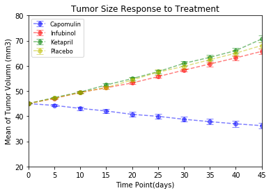
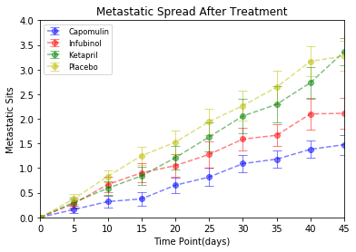
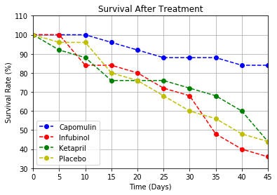
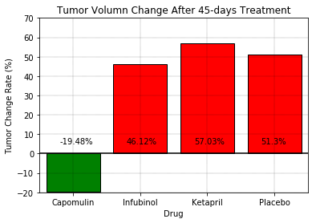

 <Trend Analysis>
* Capomulin statistically significant decreases tumor volumn compared to placebo, Infubinol and Ketapril.
* Metastasis is statistically significant lower under 45-days Capomulin treatment.
* Survival rate is higher in Capomulin arm as well.
* Over 45 days Capomulin treament, tumor volumn decareses by about 20%.  


```python
import matplotlib.pyplot as plt
import pandas as pd
import numpy as np
from scipy.stats import sem
```


```python
# Read 2 data frame
mouse= "raw_data/mouse_drug_data.csv"
trial= "raw_data/clinicaltrial_data.csv"
mouse_df = pd.read_csv(mouse)
trial_df = pd.read_csv(trial)
```


```python
# Merge 2 data frame
merge_mouseID_df = pd.merge(mouse_df, trial_df, how='outer', on='Mouse ID')
merge_mouseID_df.head(5)
```


<div>
<style>
    .dataframe thead tr:only-child th {
        text-align: right;
    }

    .dataframe thead th {
        text-align: left;
    }

    .dataframe tbody tr th {
        vertical-align: top;
    }
</style>
<table border="1" class="dataframe">
  <thead>
    <tr style="text-align: right;">
      <th></th>
      <th>Mouse ID</th>
      <th>Drug</th>
      <th>Timepoint</th>
      <th>Tumor Volume (mm3)</th>
      <th>Metastatic Sites</th>
    </tr>
  </thead>
  <tbody>
    <tr>
      <th>0</th>
      <td>f234</td>
      <td>Stelasyn</td>
      <td>0</td>
      <td>45.000000</td>
      <td>0</td>
    </tr>
    <tr>
      <th>1</th>
      <td>f234</td>
      <td>Stelasyn</td>
      <td>5</td>
      <td>47.313491</td>
      <td>0</td>
    </tr>
    <tr>
      <th>2</th>
      <td>f234</td>
      <td>Stelasyn</td>
      <td>10</td>
      <td>47.904324</td>
      <td>0</td>
    </tr>
    <tr>
      <th>3</th>
      <td>f234</td>
      <td>Stelasyn</td>
      <td>15</td>
      <td>48.735197</td>
      <td>1</td>
    </tr>
    <tr>
      <th>4</th>
      <td>f234</td>
      <td>Stelasyn</td>
      <td>20</td>
      <td>51.112713</td>
      <td>2</td>
    </tr>
  </tbody>
</table>
</div>


```python
# Mean of Tumor volumen is grouped by Drug & Timepoint
# Choose interested drugs
group_drug1= merge_mouseID_df.groupby(["Drug", "Timepoint"]).agg({"Tumor Volume (mm3)": "mean"})
stacked_group_drug1 = group_drug1.reset_index().pivot(index="Timepoint", columns="Drug", values= "Tumor Volume (mm3)")
drugs_interested = stacked_group_drug1.drop(["Ceftamin", "Naftisol", "Propriva", "Ramicane", "Stelasyn", "Zoniferol"], axis=1)
drugs_interested
```


<div>
<style>
    .dataframe thead tr:only-child th {
        text-align: right;
    }

    .dataframe thead th {
        text-align: left;
    }

    .dataframe tbody tr th {
        vertical-align: top;
    }
</style>
<table border="1" class="dataframe">
  <thead>
    <tr style="text-align: right;">
      <th>Drug</th>
      <th>Capomulin</th>
      <th>Infubinol</th>
      <th>Ketapril</th>
      <th>Placebo</th>
    </tr>
    <tr>
      <th>Timepoint</th>
      <th></th>
      <th></th>
      <th></th>
      <th></th>
    </tr>
  </thead>
  <tbody>
    <tr>
      <th>0</th>
      <td>45.000000</td>
      <td>45.000000</td>
      <td>45.000000</td>
      <td>45.000000</td>
    </tr>
    <tr>
      <th>5</th>
      <td>44.266086</td>
      <td>47.062001</td>
      <td>47.389175</td>
      <td>47.125589</td>
    </tr>
    <tr>
      <th>10</th>
      <td>43.084291</td>
      <td>49.403909</td>
      <td>49.582269</td>
      <td>49.423329</td>
    </tr>
    <tr>
      <th>15</th>
      <td>42.064317</td>
      <td>51.296397</td>
      <td>52.399974</td>
      <td>51.359742</td>
    </tr>
    <tr>
      <th>20</th>
      <td>40.716325</td>
      <td>53.197691</td>
      <td>54.920935</td>
      <td>54.364417</td>
    </tr>
    <tr>
      <th>25</th>
      <td>39.939528</td>
      <td>55.715252</td>
      <td>57.678982</td>
      <td>57.482574</td>
    </tr>
    <tr>
      <th>30</th>
      <td>38.769339</td>
      <td>58.299397</td>
      <td>60.994507</td>
      <td>59.809063</td>
    </tr>
    <tr>
      <th>35</th>
      <td>37.816839</td>
      <td>60.742461</td>
      <td>63.371686</td>
      <td>62.420615</td>
    </tr>
    <tr>
      <th>40</th>
      <td>36.958001</td>
      <td>63.162824</td>
      <td>66.068580</td>
      <td>65.052675</td>
    </tr>
    <tr>
      <th>45</th>
      <td>36.236114</td>
      <td>65.755562</td>
      <td>70.662958</td>
      <td>68.084082</td>
    </tr>
  </tbody>
</table>
</div>


```python
# SEM of Tumor volumen is grouped by Drug & Timepoint
# Choose interested drugs
group_drug2= merge_mouseID_df.groupby(["Drug", "Timepoint"]).agg({"Tumor Volume (mm3)": "sem"})
group_drug2.columns=["Errors"]
stacked_group_drug2 = group_drug2.reset_index().pivot(index="Timepoint", columns="Drug", values= "Errors")
drugs_interested_error= stacked_group_drug2.drop(["Ceftamin", "Naftisol", "Propriva", "Ramicane", "Stelasyn", "Zoniferol"], axis=1)
drugs_interested_error
```


<div>
<style>
    .dataframe thead tr:only-child th {
        text-align: right;
    }

    .dataframe thead th {
        text-align: left;
    }

    .dataframe tbody tr th {
        vertical-align: top;
    }
</style>
<table border="1" class="dataframe">
  <thead>
    <tr style="text-align: right;">
      <th>Drug</th>
      <th>Capomulin</th>
      <th>Infubinol</th>
      <th>Ketapril</th>
      <th>Placebo</th>
    </tr>
    <tr>
      <th>Timepoint</th>
      <th></th>
      <th></th>
      <th></th>
      <th></th>
    </tr>
  </thead>
  <tbody>
    <tr>
      <th>0</th>
      <td>0.000000</td>
      <td>0.000000</td>
      <td>0.000000</td>
      <td>0.000000</td>
    </tr>
    <tr>
      <th>5</th>
      <td>0.448593</td>
      <td>0.235102</td>
      <td>0.264819</td>
      <td>0.218091</td>
    </tr>
    <tr>
      <th>10</th>
      <td>0.702684</td>
      <td>0.282346</td>
      <td>0.357421</td>
      <td>0.402064</td>
    </tr>
    <tr>
      <th>15</th>
      <td>0.838617</td>
      <td>0.357705</td>
      <td>0.580268</td>
      <td>0.614461</td>
    </tr>
    <tr>
      <th>20</th>
      <td>0.909731</td>
      <td>0.476210</td>
      <td>0.726484</td>
      <td>0.839609</td>
    </tr>
    <tr>
      <th>25</th>
      <td>0.881642</td>
      <td>0.550315</td>
      <td>0.755413</td>
      <td>1.034872</td>
    </tr>
    <tr>
      <th>30</th>
      <td>0.934460</td>
      <td>0.631061</td>
      <td>0.934121</td>
      <td>1.218231</td>
    </tr>
    <tr>
      <th>35</th>
      <td>1.052241</td>
      <td>0.984155</td>
      <td>1.127867</td>
      <td>1.287481</td>
    </tr>
    <tr>
      <th>40</th>
      <td>1.223608</td>
      <td>1.055220</td>
      <td>1.158449</td>
      <td>1.370634</td>
    </tr>
    <tr>
      <th>45</th>
      <td>1.223977</td>
      <td>1.144427</td>
      <td>1.453186</td>
      <td>1.351726</td>
    </tr>
  </tbody>
</table>
</div>


```python
# Plot for tumor size change 
fig, ax = plt.subplots()
c_means= drugs_interested.iloc[:, 0]
c_sem= drugs_interested_error.iloc[:, 0]
i_means= drugs_interested.iloc[:, 1]
i_sem= drugs_interested_error.iloc[:, 1]
k_means= drugs_interested.iloc[:, 2]
k_sem= drugs_interested_error.iloc[:, 2]
p_means= drugs_interested.iloc[:, 3]
p_sem= drugs_interested_error.iloc[:, 3]

ax.errorbar(drugs_interested.index, c_means, c_sem, fmt="o--", color="b",
            alpha=0.5, label="Capomulin", elinewidth = 1, capthick = 1, capsize = 5)
ax.errorbar(drugs_interested.index, i_means, i_sem, fmt="o--", color="r",
            alpha=0.5, label="Infubinol", elinewidth = 1, capthick = 1, capsize = 5)
ax.errorbar(drugs_interested.index, k_means, k_sem, fmt="o--", color="g",
            alpha=0.5, label="Ketapril", elinewidth = 1, capthick = 1, capsize = 5)
ax.errorbar(drugs_interested.index, p_means, p_sem, fmt="o--", color="y",
            alpha=0.5, label="Placebo", elinewidth = 1, capthick = 1, capsize = 5)

ax.set_xlim(0, 45)
ax.set_ylim(20, 80)
plt.title('Tumor Size Response to Treatment')
ax.set_xlabel("Time Point(days)")
ax.set_ylabel("Mean of Tumor Volumn (mm3)")

plt.legend(loc="best", fontsize="small", fancybox=True)
plt.show()

```





```python
# Mean of metastatic site is grouped by Drug & Timepoint
# Choose interested drugs
group_drug3= merge_mouseID_df.groupby(["Drug", "Timepoint"]).agg({"Metastatic Sites": "mean"})
stacked_group_drug3 = group_drug3.reset_index().pivot(index="Timepoint", columns="Drug", values= "Metastatic Sites")
drugs_interested_mets = stacked_group_drug3.drop(["Ceftamin", "Naftisol", "Propriva", "Ramicane", "Stelasyn", "Zoniferol"], axis=1)
drugs_interested_mets
```


<div>
<style>
    .dataframe thead tr:only-child th {
        text-align: right;
    }

    .dataframe thead th {
        text-align: left;
    }

    .dataframe tbody tr th {
        vertical-align: top;
    }
</style>
<table border="1" class="dataframe">
  <thead>
    <tr style="text-align: right;">
      <th>Drug</th>
      <th>Capomulin</th>
      <th>Infubinol</th>
      <th>Ketapril</th>
      <th>Placebo</th>
    </tr>
    <tr>
      <th>Timepoint</th>
      <th></th>
      <th></th>
      <th></th>
      <th></th>
    </tr>
  </thead>
  <tbody>
    <tr>
      <th>0</th>
      <td>0.000000</td>
      <td>0.000000</td>
      <td>0.000000</td>
      <td>0.000000</td>
    </tr>
    <tr>
      <th>5</th>
      <td>0.160000</td>
      <td>0.280000</td>
      <td>0.304348</td>
      <td>0.375000</td>
    </tr>
    <tr>
      <th>10</th>
      <td>0.320000</td>
      <td>0.666667</td>
      <td>0.590909</td>
      <td>0.833333</td>
    </tr>
    <tr>
      <th>15</th>
      <td>0.375000</td>
      <td>0.904762</td>
      <td>0.842105</td>
      <td>1.250000</td>
    </tr>
    <tr>
      <th>20</th>
      <td>0.652174</td>
      <td>1.050000</td>
      <td>1.210526</td>
      <td>1.526316</td>
    </tr>
    <tr>
      <th>25</th>
      <td>0.818182</td>
      <td>1.277778</td>
      <td>1.631579</td>
      <td>1.941176</td>
    </tr>
    <tr>
      <th>30</th>
      <td>1.090909</td>
      <td>1.588235</td>
      <td>2.055556</td>
      <td>2.266667</td>
    </tr>
    <tr>
      <th>35</th>
      <td>1.181818</td>
      <td>1.666667</td>
      <td>2.294118</td>
      <td>2.642857</td>
    </tr>
    <tr>
      <th>40</th>
      <td>1.380952</td>
      <td>2.100000</td>
      <td>2.733333</td>
      <td>3.166667</td>
    </tr>
    <tr>
      <th>45</th>
      <td>1.476190</td>
      <td>2.111111</td>
      <td>3.363636</td>
      <td>3.272727</td>
    </tr>
  </tbody>
</table>
</div>


```python
# SEM of mets sites is grouped by Drug & Timepoint
# Choose interested drugs
group_drug4= merge_mouseID_df.groupby(["Drug", "Timepoint"]).agg({"Metastatic Sites": "sem"})
group_drug4.columns=["Errors"]
stacked_group_drug4 = group_drug4.reset_index().pivot(index="Timepoint", columns="Drug", values= "Errors")
drugs_interested_metserror= stacked_group_drug4.drop(["Ceftamin", "Naftisol", "Propriva", "Ramicane", "Stelasyn", "Zoniferol"], axis=1)
drugs_interested_metserror
```


<div>
<style>
    .dataframe thead tr:only-child th {
        text-align: right;
    }

    .dataframe thead th {
        text-align: left;
    }

    .dataframe tbody tr th {
        vertical-align: top;
    }
</style>
<table border="1" class="dataframe">
  <thead>
    <tr style="text-align: right;">
      <th>Drug</th>
      <th>Capomulin</th>
      <th>Infubinol</th>
      <th>Ketapril</th>
      <th>Placebo</th>
    </tr>
    <tr>
      <th>Timepoint</th>
      <th></th>
      <th></th>
      <th></th>
      <th></th>
    </tr>
  </thead>
  <tbody>
    <tr>
      <th>0</th>
      <td>0.000000</td>
      <td>0.000000</td>
      <td>0.000000</td>
      <td>0.000000</td>
    </tr>
    <tr>
      <th>5</th>
      <td>0.074833</td>
      <td>0.091652</td>
      <td>0.098100</td>
      <td>0.100947</td>
    </tr>
    <tr>
      <th>10</th>
      <td>0.125433</td>
      <td>0.159364</td>
      <td>0.142018</td>
      <td>0.115261</td>
    </tr>
    <tr>
      <th>15</th>
      <td>0.132048</td>
      <td>0.194015</td>
      <td>0.191381</td>
      <td>0.190221</td>
    </tr>
    <tr>
      <th>20</th>
      <td>0.161621</td>
      <td>0.234801</td>
      <td>0.236680</td>
      <td>0.234064</td>
    </tr>
    <tr>
      <th>25</th>
      <td>0.181818</td>
      <td>0.265753</td>
      <td>0.288275</td>
      <td>0.263888</td>
    </tr>
    <tr>
      <th>30</th>
      <td>0.172944</td>
      <td>0.227823</td>
      <td>0.347467</td>
      <td>0.300264</td>
    </tr>
    <tr>
      <th>35</th>
      <td>0.169496</td>
      <td>0.224733</td>
      <td>0.361418</td>
      <td>0.341412</td>
    </tr>
    <tr>
      <th>40</th>
      <td>0.175610</td>
      <td>0.314466</td>
      <td>0.315725</td>
      <td>0.297294</td>
    </tr>
    <tr>
      <th>45</th>
      <td>0.202591</td>
      <td>0.309320</td>
      <td>0.278722</td>
      <td>0.304240</td>
    </tr>
  </tbody>
</table>
</div>


```python
# Plot for mets sites change 
fig, ax = plt.subplots()
c_means_m= drugs_interested_mets.iloc[:, 0]
c_sem_m= drugs_interested_metserror.iloc[:, 0]
i_means_m= drugs_interested_mets.iloc[:, 1]
i_sem_m= drugs_interested_metserror.iloc[:, 1]
k_means_m= drugs_interested_mets.iloc[:, 2]
k_sem_m= drugs_interested_metserror.iloc[:, 2]
p_means_m= drugs_interested_mets.iloc[:, 3]
p_sem_m= drugs_interested_metserror.iloc[:, 3]

ax.errorbar(drugs_interested_mets.index, c_means_m, c_sem_m, fmt="o--", color="b",
            alpha=0.5, label="Capomulin", elinewidth = 1, capthick = 1, capsize = 5)
ax.errorbar(drugs_interested_mets.index, i_means_m, i_sem_m, fmt="o--", color="r",
            alpha=0.5, label="Infubinol", elinewidth = 1, capthick = 1, capsize = 5)
ax.errorbar(drugs_interested_mets.index, k_means_m, k_sem_m, fmt="o--", color="g",
            alpha=0.5, label="Ketapril", elinewidth = 1, capthick = 1, capsize = 5)
ax.errorbar(drugs_interested_mets.index, p_means_m, p_sem_m, fmt="o--", color="y",
            alpha=0.5, label="Placebo", elinewidth = 1, capthick = 1, capsize = 5)

ax.set_xlim(0, 45)
ax.set_ylim(0, 4)
plt.title('Metastatic Spread After Treatment')
ax.set_xlabel("Time Point(days)")
ax.set_ylabel("Metastatic Sits")

plt.legend(loc="best", fontsize="small", fancybox=True)
plt.show()

```





```python
# Count available data in Mouse ID for survival
group_drug5= merge_mouseID_df.groupby(["Drug", "Timepoint"]).agg({"Mouse ID": "count"})
stacked_group_drug5 = group_drug5.reset_index().pivot(index="Timepoint", columns="Drug", values= "Mouse ID")
drugs_interested_sur = stacked_group_drug5.drop(["Ceftamin", "Naftisol", "Propriva", "Ramicane", "Stelasyn", "Zoniferol"], axis=1)
drugs_interested_sur
```


<div>
<style>
    .dataframe thead tr:only-child th {
        text-align: right;
    }

    .dataframe thead th {
        text-align: left;
    }

    .dataframe tbody tr th {
        vertical-align: top;
    }
</style>
<table border="1" class="dataframe">
  <thead>
    <tr style="text-align: right;">
      <th>Drug</th>
      <th>Capomulin</th>
      <th>Infubinol</th>
      <th>Ketapril</th>
      <th>Placebo</th>
    </tr>
    <tr>
      <th>Timepoint</th>
      <th></th>
      <th></th>
      <th></th>
      <th></th>
    </tr>
  </thead>
  <tbody>
    <tr>
      <th>0</th>
      <td>25</td>
      <td>25</td>
      <td>25</td>
      <td>25</td>
    </tr>
    <tr>
      <th>5</th>
      <td>25</td>
      <td>25</td>
      <td>23</td>
      <td>24</td>
    </tr>
    <tr>
      <th>10</th>
      <td>25</td>
      <td>21</td>
      <td>22</td>
      <td>24</td>
    </tr>
    <tr>
      <th>15</th>
      <td>24</td>
      <td>21</td>
      <td>19</td>
      <td>20</td>
    </tr>
    <tr>
      <th>20</th>
      <td>23</td>
      <td>20</td>
      <td>19</td>
      <td>19</td>
    </tr>
    <tr>
      <th>25</th>
      <td>22</td>
      <td>18</td>
      <td>19</td>
      <td>17</td>
    </tr>
    <tr>
      <th>30</th>
      <td>22</td>
      <td>17</td>
      <td>18</td>
      <td>15</td>
    </tr>
    <tr>
      <th>35</th>
      <td>22</td>
      <td>12</td>
      <td>17</td>
      <td>14</td>
    </tr>
    <tr>
      <th>40</th>
      <td>21</td>
      <td>10</td>
      <td>15</td>
      <td>12</td>
    </tr>
    <tr>
      <th>45</th>
      <td>21</td>
      <td>9</td>
      <td>11</td>
      <td>11</td>
    </tr>
  </tbody>
</table>
</div>


```python
# Plot for survival

plt.plot(drugs_interested_sur.index, drugs_interested_sur['Capomulin']/drugs_interested_sur['Capomulin'][0]*100,
             'o--', label='Capomulin', color="b")
plt.plot(drugs_interested_sur.index, drugs_interested_sur['Infubinol']/drugs_interested_sur['Infubinol'][0]*100,
             'o--', label='Infubinol', color="r")
plt.plot(drugs_interested_sur.index, drugs_interested_sur['Ketapril']/drugs_interested_sur['Ketapril'][0]*100,
             'o--', label='Ketapril', color="g")
plt.plot(drugs_interested_sur.index, drugs_interested_sur['Placebo']/drugs_interested_sur['Placebo'][0]*100,
             'o--', label='Placebo', color="y")

plt.title('Survival After Treatment')
plt.xlabel('Time (Days)')
plt.ylabel('Survival Rate (%)')
plt.legend(loc = 'best')
plt.xlim(0, 45)
plt.ylim(30, 110)
plt.grid()
plt.show()


```





```python
# Make a new dataframe and Calculate % of tumor volumn change 
mean_chang = []
mean_change = round((drugs_interested.iloc[9,:]-drugs_interested.iloc[0,:])/(drugs_interested.iloc[0,:])*100,2)
new_df = pd.DataFrame(mean_change)
new_df.reset_index(inplace = True)
new_df.columns=["Drug","% of tumor volumn change"]

# Generate bar chart
x_axis = new_df["Drug"]
plt.bar(x_axis, mean_change, color=['g', 'r', 'r', 'r'], alpha=1, edgecolor = 'black')
plt.grid(color = 'black', linestyle='--', linewidth=0.2)
plt.axhline(y=0, color='black', linestyle='-')
plt.title("Tumor Volumn Change After 45-days Treatment")
plt.xlabel("Drug")
plt.ylabel("Tumor Change Rate (%)")
plt.legend(loc = "best")
plt.xlim(-0.5, 3.5)
plt.ylim(-20, 70)
for x in range(0, 4):
    plt.text(x-0.2, 5, str(mean_change[x])+'%', color = 'black')
plt.show()

```




