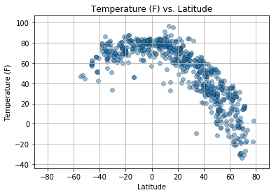
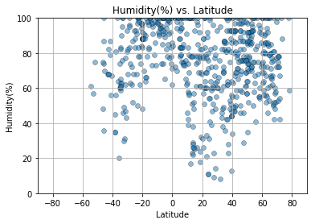
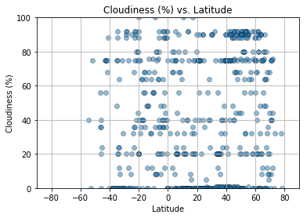
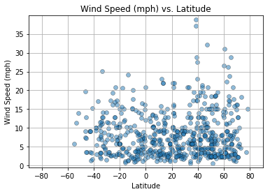

# Trends

Trend 1: Among latitude -20 to 20, temperature & humidity are generally higher than others.
Trend 2: There is no correlation between latitude & cloudiness.
Trend 3: Latitude around -20 or 40 may have higher wind speed.

# WeatherPy

In this example, you'll be creating a Python script to visualize the weather of 500+ cities across the world of varying distance from the equator. To accomplish this, you'll be utilizing a [simple Python library](https://pypi.python.org/pypi/citipy), the [OpenWeatherMap API](https://openweathermap.org/api), and a little common sense to create a representative model of weather across world cities.

Your objective is to build a series of scatter plots to showcase the following relationships:

* Temperature (F) vs. Latitude
* Humidity (%) vs. Latitude
* Cloudiness (%) vs. Latitude
* Wind Speed (mph) vs. Latitude

Your final notebook must:

* Randomly select **at least** 500 unique (non-repeat) cities based on latitude and longitude.
* Perform a weather check on each of the cities using a series of successive API calls. 
* Include a print log of each city as it's being processed with the city number, city name, and requested URL.
* Save both a CSV of all data retrieved and png images for each scatter plot.

As final considerations:

* You must use the Matplotlib libraries.
* You must include a written description of three observable trends based on the data. 
* You must use proper labeling of your plots, including aspects like: Plot Titles (with date of analysis) and Axes Labels.
* You must include an exported markdown version of your Notebook called  `README.md` in your GitHub repository.  
* See [Example Solution](WeatherPy_Example.pdf) for a reference on expected format. 

## Hints and Considerations

* You may want to start this assignment by refreshing yourself on 4th grade geography, in particular, the [geographic coordinate system](http://desktop.arcgis.com/en/arcmap/10.3/guide-books/map-projections/about-geographic-coordinate-systems.htm). 

* Next, spend the requisite time necessary to study the OpenWeatherMap API. Based on your initial study, you should be able to answer  basic questions about the API: Where do you request the API key? Which Weather API in particular will you need? What URL endpoints does it expect? What JSON structure does it respond with? Before you write a line of code, you should be aiming to have a crystal clear understanding of your intended outcome.

* You may have to install the [citipy Python library](https://pypi.python.org/pypi/citipy). You can do this from Git Bash (or the Anaconda terminal) by typing the command `pip install citipy`

* Though we've never worked with the [citipy Python library](https://pypi.python.org/pypi/citipy), push yourself to decipher how it works, and why it might be relevant. Before you try to incorporate the library into your analysis, start by creating simple test cases outside your main script to confirm that you are using it correctly. Too often, when introduced to a new library, students get bogged down by the most minor of errors -- spending hours investigating their entire code -- when, in fact, a simple and focused test would have shown their basic utilization of the library was wrong from the start. Don't let this be you!

* Part of our expectation in this challenge is that you will use critical thinking skills to understand how and why we're recommending the tools we are. What is Citipy for? Why would you use it in conjunction with the OpenWeatherMap API? How would you do so?

* In building your script, pay attention to the cities you are using in your query pool. Are you getting coverage of the full gamut of latitudes and longitudes? Or are you simply choosing 500 cities concentrated in one region of the world? Even if you were a geographic genius, simply rattling 500 cities based on your human selection would create a biased dataset. Be thinking of how you should counter this. (Hint: Consider the full range of latitudes).


```python
# Dependencies
import csv
import json
import matplotlib.pyplot as plt
import requests
import pandas as pd
import numpy as np
from citipy import citipy
from pprint import pprint

#import api_key
from config_weather import api_key
```


```python
# Randomly select 1800 coordinations 

def random_list(size):
    random_lat = [np.random.randint(-90,90) for x in range(size) ]
    random_lon = [np.random.randint(-180,180) for x in range(size)] 
    coordinates = [(random_lat[x], random_lon[x]) for x in range(size)] 
    return coordinates 

list= random_list(1800)
```


```python
# Convert coordinates to city name & country code 
cities = []

for coordinate_pair in list:
    lat, lon = coordinate_pair
    cities.append(citipy.nearest_city(lat, lon))
```


```python
codes = []
names = []

for city in cities:
    names.append(city.city_name)
    codes.append(city.country_code)
#     print(f"The country code of {names} is '{codes}'.")
```


```python
main_df = pd.DataFrame({
    "City Name": names,
    "Country Code": codes
})

main_df["Temperature(F)"] = ""
main_df["Humidity(%)"] = ""
main_df["Cloudiness (%)"] = ""
main_df["Wind Speed (mph)"] = ""
main_df["Latitude"] = ""

clear_df = main_df.drop_duplicates(keep="first")
clear_df.reset_index
clear_df.head()
```


<div>
<style>
    .dataframe thead tr:only-child th {
        text-align: right;
    }

    .dataframe thead th {
        text-align: left;
    }

    .dataframe tbody tr th {
        vertical-align: top;
    }
</style>
<table border="1" class="dataframe">
  <thead>
    <tr style="text-align: right;">
      <th></th>
      <th>City Name</th>
      <th>Country Code</th>
      <th>Temperature(F)</th>
      <th>Humidity(%)</th>
      <th>Cloudiness (%)</th>
      <th>Wind Speed (mph)</th>
      <th>Latitude</th>
    </tr>
  </thead>
  <tbody>
    <tr>
      <th>0</th>
      <td>port elizabeth</td>
      <td>za</td>
      <td></td>
      <td></td>
      <td></td>
      <td></td>
      <td></td>
    </tr>
    <tr>
      <th>1</th>
      <td>vaini</td>
      <td>to</td>
      <td></td>
      <td></td>
      <td></td>
      <td></td>
      <td></td>
    </tr>
    <tr>
      <th>2</th>
      <td>attawapiskat</td>
      <td>ca</td>
      <td></td>
      <td></td>
      <td></td>
      <td></td>
      <td></td>
    </tr>
    <tr>
      <th>3</th>
      <td>bredasdorp</td>
      <td>za</td>
      <td></td>
      <td></td>
      <td></td>
      <td></td>
      <td></td>
    </tr>
    <tr>
      <th>4</th>
      <td>ixtapa</td>
      <td>mx</td>
      <td></td>
      <td></td>
      <td></td>
      <td></td>
      <td></td>
    </tr>
  </tbody>
</table>
</div>


```python
# Loop through the clear_df and run a temp, humidity, cloudness, wind speed, longitude for each city

counter=0
for index, row in clear_df.iterrows():
    url = "http://api.openweathermap.org/data/2.5/weather?"
    units = "imperial"
    query_url = f"{url}appid={api_key}&units={units}&q={row['City Name']}"
    
    print ("it's running city # " + str(index))  
    counter+=1
    
    response = requests.get(query_url).json() 
    print(query_url)
    try:
        
        temp = response['main']['temp']
        humidity = response['main']['humidity']
        cloudness = response['clouds']['all']
        windspeed = response['wind']['speed']
        lat = response['coord']['lat']
        
        clear_df.set_value(index, "Temperature(F)", temp)
        clear_df.set_value(index, 'Humidity(%)', humidity)
        clear_df.set_value(index, 'Cloudiness (%)', cloudness)
        clear_df.set_value(index, 'Wind Speed (mph)', windspeed)
        clear_df.set_value(index, "Latitude", lat)
        
    except(KeyError, IndexError) as e:
        print (e)
        continue

# Check the data
print("-------------------------------------------------------------------------------------") 
print(len(clear_df)) 
clear_df.head()
```

    it's running city # 0
    http://api.openweathermap.org/data/2.5/weather?appid=643b54ffcb606cbf328166a9128fc125&units=imperial&q=port elizabeth
    it's running city # 1
    http://api.openweathermap.org/data/2.5/weather?appid=643b54ffcb606cbf328166a9128fc125&units=imperial&q=vaini
    it's running city # 2
    http://api.openweathermap.org/data/2.5/weather?appid=643b54ffcb606cbf328166a9128fc125&units=imperial&q=attawapiskat
    'main'
    it's running city # 3
    http://api.openweathermap.org/data/2.5/weather?appid=643b54ffcb606cbf328166a9128fc125&units=imperial&q=bredasdorp
    it's running city # 4
    http://api.openweathermap.org/data/2.5/weather?appid=643b54ffcb606cbf328166a9128fc125&units=imperial&q=ixtapa
    it's running city # 5
    http://api.openweathermap.org/data/2.5/weather?appid=643b54ffcb606cbf328166a9128fc125&units=imperial&q=rikitea
    it's running city # 6
    http://api.openweathermap.org/data/2.5/weather?appid=643b54ffcb606cbf328166a9128fc125&units=imperial&q=sentyabrskiy
    'main'
    it's running city # 7
    http://api.openweathermap.org/data/2.5/weather?appid=643b54ffcb606cbf328166a9128fc125&units=imperial&q=borogontsy
    it's running city # 8
    http://api.openweathermap.org/data/2.5/weather?appid=643b54ffcb606cbf328166a9128fc125&units=imperial&q=jamestown
    it's running city # 9
    http://api.openweathermap.org/data/2.5/weather?appid=643b54ffcb606cbf328166a9128fc125&units=imperial&q=kavieng
    it's running city # 10
    http://api.openweathermap.org/data/2.5/weather?appid=643b54ffcb606cbf328166a9128fc125&units=imperial&q=honningsvag
    it's running city # 11
    http://api.openweathermap.org/data/2.5/weather?appid=643b54ffcb606cbf328166a9128fc125&units=imperial&q=kodiak
    it's running city # 12
    http://api.openweathermap.org/data/2.5/weather?appid=643b54ffcb606cbf328166a9128fc125&units=imperial&q=carnarvon
    it's running city # 13
    http://api.openweathermap.org/data/2.5/weather?appid=643b54ffcb606cbf328166a9128fc125&units=imperial&q=byron bay
    it's running city # 14
    http://api.openweathermap.org/data/2.5/weather?appid=643b54ffcb606cbf328166a9128fc125&units=imperial&q=albany
    it's running city # 15
    http://api.openweathermap.org/data/2.5/weather?appid=643b54ffcb606cbf328166a9128fc125&units=imperial&q=thompson
    it's running city # 16
    http://api.openweathermap.org/data/2.5/weather?appid=643b54ffcb606cbf328166a9128fc125&units=imperial&q=antalaha
    it's running city # 17
    http://api.openweathermap.org/data/2.5/weather?appid=643b54ffcb606cbf328166a9128fc125&units=imperial&q=ushuaia
    it's running city # 18
    http://api.openweathermap.org/data/2.5/weather?appid=643b54ffcb606cbf328166a9128fc125&units=imperial&q=airai
    it's running city # 19
    http://api.openweathermap.org/data/2.5/weather?appid=643b54ffcb606cbf328166a9128fc125&units=imperial&q=maldonado
    it's running city # 20
    http://api.openweathermap.org/data/2.5/weather?appid=643b54ffcb606cbf328166a9128fc125&units=imperial&q=ucluelet
    it's running city # 21
    http://api.openweathermap.org/data/2.5/weather?appid=643b54ffcb606cbf328166a9128fc125&units=imperial&q=butaritari
    it's running city # 22
    http://api.openweathermap.org/data/2.5/weather?appid=643b54ffcb606cbf328166a9128fc125&units=imperial&q=sinjar
    it's running city # 23
    http://api.openweathermap.org/data/2.5/weather?appid=643b54ffcb606cbf328166a9128fc125&units=imperial&q=torbay
    it's running city # 24
    http://api.openweathermap.org/data/2.5/weather?appid=643b54ffcb606cbf328166a9128fc125&units=imperial&q=cape town
    it's running city # 25
    http://api.openweathermap.org/data/2.5/weather?appid=643b54ffcb606cbf328166a9128fc125&units=imperial&q=margate
    it's running city # 26
    http://api.openweathermap.org/data/2.5/weather?appid=643b54ffcb606cbf328166a9128fc125&units=imperial&q=znamenskoye
    it's running city # 29
    http://api.openweathermap.org/data/2.5/weather?appid=643b54ffcb606cbf328166a9128fc125&units=imperial&q=kropotkin
    it's running city # 30
    http://api.openweathermap.org/data/2.5/weather?appid=643b54ffcb606cbf328166a9128fc125&units=imperial&q=praia da vitoria
    it's running city # 31
    http://api.openweathermap.org/data/2.5/weather?appid=643b54ffcb606cbf328166a9128fc125&units=imperial&q=viedma
    it's running city # 32
    http://api.openweathermap.org/data/2.5/weather?appid=643b54ffcb606cbf328166a9128fc125&units=imperial&q=saskylakh
    it's running city # 33
    http://api.openweathermap.org/data/2.5/weather?appid=643b54ffcb606cbf328166a9128fc125&units=imperial&q=faya
    it's running city # 34
    http://api.openweathermap.org/data/2.5/weather?appid=643b54ffcb606cbf328166a9128fc125&units=imperial&q=price
    it's running city # 35
    http://api.openweathermap.org/data/2.5/weather?appid=643b54ffcb606cbf328166a9128fc125&units=imperial&q=coruripe
    it's running city # 36
    http://api.openweathermap.org/data/2.5/weather?appid=643b54ffcb606cbf328166a9128fc125&units=imperial&q=moranbah
    it's running city # 38
    http://api.openweathermap.org/data/2.5/weather?appid=643b54ffcb606cbf328166a9128fc125&units=imperial&q=valparaiso
    it's running city # 39
    http://api.openweathermap.org/data/2.5/weather?appid=643b54ffcb606cbf328166a9128fc125&units=imperial&q=kyabram
    it's running city # 40
    http://api.openweathermap.org/data/2.5/weather?appid=643b54ffcb606cbf328166a9128fc125&units=imperial&q=castro
    it's running city # 41
    http://api.openweathermap.org/data/2.5/weather?appid=643b54ffcb606cbf328166a9128fc125&units=imperial&q=avarua
    it's running city # 42
    http://api.openweathermap.org/data/2.5/weather?appid=643b54ffcb606cbf328166a9128fc125&units=imperial&q=tuktoyaktuk
    it's running city # 43
    http://api.openweathermap.org/data/2.5/weather?appid=643b54ffcb606cbf328166a9128fc125&units=imperial&q=bandarbeyla
    it's running city # 44
    http://api.openweathermap.org/data/2.5/weather?appid=643b54ffcb606cbf328166a9128fc125&units=imperial&q=cienfuegos
    it's running city # 45
    http://api.openweathermap.org/data/2.5/weather?appid=643b54ffcb606cbf328166a9128fc125&units=imperial&q=sitrah
    it's running city # 46
    http://api.openweathermap.org/data/2.5/weather?appid=643b54ffcb606cbf328166a9128fc125&units=imperial&q=ancud
    it's running city # 47
    http://api.openweathermap.org/data/2.5/weather?appid=643b54ffcb606cbf328166a9128fc125&units=imperial&q=riyadh
    it's running city # 50
    http://api.openweathermap.org/data/2.5/weather?appid=643b54ffcb606cbf328166a9128fc125&units=imperial&q=hobyo
    it's running city # 52
    http://api.openweathermap.org/data/2.5/weather?appid=643b54ffcb606cbf328166a9128fc125&units=imperial&q=ulladulla
    it's running city # 53
    http://api.openweathermap.org/data/2.5/weather?appid=643b54ffcb606cbf328166a9128fc125&units=imperial&q=hofn
    it's running city # 54
    http://api.openweathermap.org/data/2.5/weather?appid=643b54ffcb606cbf328166a9128fc125&units=imperial&q=hilo
    it's running city # 55
    http://api.openweathermap.org/data/2.5/weather?appid=643b54ffcb606cbf328166a9128fc125&units=imperial&q=whitecourt
    it's running city # 57
    http://api.openweathermap.org/data/2.5/weather?appid=643b54ffcb606cbf328166a9128fc125&units=imperial&q=hobart
    it's running city # 59
    http://api.openweathermap.org/data/2.5/weather?appid=643b54ffcb606cbf328166a9128fc125&units=imperial&q=punta arenas
    it's running city # 60
    http://api.openweathermap.org/data/2.5/weather?appid=643b54ffcb606cbf328166a9128fc125&units=imperial&q=pangkalanbuun
    it's running city # 61
    http://api.openweathermap.org/data/2.5/weather?appid=643b54ffcb606cbf328166a9128fc125&units=imperial&q=arraial do cabo
    it's running city # 62
    http://api.openweathermap.org/data/2.5/weather?appid=643b54ffcb606cbf328166a9128fc125&units=imperial&q=cayenne
    it's running city # 65
    http://api.openweathermap.org/data/2.5/weather?appid=643b54ffcb606cbf328166a9128fc125&units=imperial&q=dikson
    it's running city # 66
    http://api.openweathermap.org/data/2.5/weather?appid=643b54ffcb606cbf328166a9128fc125&units=imperial&q=busselton
    it's running city # 67
    http://api.openweathermap.org/data/2.5/weather?appid=643b54ffcb606cbf328166a9128fc125&units=imperial&q=astana
    it's running city # 68
    http://api.openweathermap.org/data/2.5/weather?appid=643b54ffcb606cbf328166a9128fc125&units=imperial&q=hermanus
    it's running city # 70
    http://api.openweathermap.org/data/2.5/weather?appid=643b54ffcb606cbf328166a9128fc125&units=imperial&q=ust-kamchatsk
    'main'
    it's running city # 72
    http://api.openweathermap.org/data/2.5/weather?appid=643b54ffcb606cbf328166a9128fc125&units=imperial&q=ponta do sol
    it's running city # 73
    http://api.openweathermap.org/data/2.5/weather?appid=643b54ffcb606cbf328166a9128fc125&units=imperial&q=kahului
    it's running city # 74
    http://api.openweathermap.org/data/2.5/weather?appid=643b54ffcb606cbf328166a9128fc125&units=imperial&q=waingapu
    it's running city # 75
    http://api.openweathermap.org/data/2.5/weather?appid=643b54ffcb606cbf328166a9128fc125&units=imperial&q=vaitupu
    'main'
    it's running city # 76
    http://api.openweathermap.org/data/2.5/weather?appid=643b54ffcb606cbf328166a9128fc125&units=imperial&q=shchelyayur
    'main'
    it's running city # 78
    http://api.openweathermap.org/data/2.5/weather?appid=643b54ffcb606cbf328166a9128fc125&units=imperial&q=georgetown
    it's running city # 79
    http://api.openweathermap.org/data/2.5/weather?appid=643b54ffcb606cbf328166a9128fc125&units=imperial&q=palabuhanratu
    'main'
    it's running city # 80
    http://api.openweathermap.org/data/2.5/weather?appid=643b54ffcb606cbf328166a9128fc125&units=imperial&q=ujhani
    it's running city # 82
    http://api.openweathermap.org/data/2.5/weather?appid=643b54ffcb606cbf328166a9128fc125&units=imperial&q=san lawrenz
    it's running city # 83
    http://api.openweathermap.org/data/2.5/weather?appid=643b54ffcb606cbf328166a9128fc125&units=imperial&q=bluff
    it's running city # 85
    http://api.openweathermap.org/data/2.5/weather?appid=643b54ffcb606cbf328166a9128fc125&units=imperial&q=sitka
    it's running city # 86
    http://api.openweathermap.org/data/2.5/weather?appid=643b54ffcb606cbf328166a9128fc125&units=imperial&q=ketchikan
    it's running city # 87
    http://api.openweathermap.org/data/2.5/weather?appid=643b54ffcb606cbf328166a9128fc125&units=imperial&q=kingisepp
    it's running city # 88
    http://api.openweathermap.org/data/2.5/weather?appid=643b54ffcb606cbf328166a9128fc125&units=imperial&q=matara
    it's running city # 90
    http://api.openweathermap.org/data/2.5/weather?appid=643b54ffcb606cbf328166a9128fc125&units=imperial&q=nizhneyansk
    'main'
    it's running city # 91
    http://api.openweathermap.org/data/2.5/weather?appid=643b54ffcb606cbf328166a9128fc125&units=imperial&q=vyartsilya
    it's running city # 92
    http://api.openweathermap.org/data/2.5/weather?appid=643b54ffcb606cbf328166a9128fc125&units=imperial&q=norman wells
    it's running city # 94
    http://api.openweathermap.org/data/2.5/weather?appid=643b54ffcb606cbf328166a9128fc125&units=imperial&q=hithadhoo
    it's running city # 95
    http://api.openweathermap.org/data/2.5/weather?appid=643b54ffcb606cbf328166a9128fc125&units=imperial&q=yei
    'main'
    it's running city # 96
    http://api.openweathermap.org/data/2.5/weather?appid=643b54ffcb606cbf328166a9128fc125&units=imperial&q=pangnirtung
    it's running city # 98
    http://api.openweathermap.org/data/2.5/weather?appid=643b54ffcb606cbf328166a9128fc125&units=imperial&q=qandala
    it's running city # 100
    http://api.openweathermap.org/data/2.5/weather?appid=643b54ffcb606cbf328166a9128fc125&units=imperial&q=luderitz
    it's running city # 101
    http://api.openweathermap.org/data/2.5/weather?appid=643b54ffcb606cbf328166a9128fc125&units=imperial&q=sola
    it's running city # 102
    http://api.openweathermap.org/data/2.5/weather?appid=643b54ffcb606cbf328166a9128fc125&units=imperial&q=soe
    it's running city # 103
    http://api.openweathermap.org/data/2.5/weather?appid=643b54ffcb606cbf328166a9128fc125&units=imperial&q=streator
    it's running city # 104
    http://api.openweathermap.org/data/2.5/weather?appid=643b54ffcb606cbf328166a9128fc125&units=imperial&q=clyde river
    it's running city # 105
    http://api.openweathermap.org/data/2.5/weather?appid=643b54ffcb606cbf328166a9128fc125&units=imperial&q=lata
    it's running city # 107
    http://api.openweathermap.org/data/2.5/weather?appid=643b54ffcb606cbf328166a9128fc125&units=imperial&q=ugoofaaru
    it's running city # 108
    http://api.openweathermap.org/data/2.5/weather?appid=643b54ffcb606cbf328166a9128fc125&units=imperial&q=mataura
    it's running city # 110
    http://api.openweathermap.org/data/2.5/weather?appid=643b54ffcb606cbf328166a9128fc125&units=imperial&q=tiksi
    it's running city # 111
    http://api.openweathermap.org/data/2.5/weather?appid=643b54ffcb606cbf328166a9128fc125&units=imperial&q=lodja
    it's running city # 112
    http://api.openweathermap.org/data/2.5/weather?appid=643b54ffcb606cbf328166a9128fc125&units=imperial&q=khromtau
    it's running city # 113
    http://api.openweathermap.org/data/2.5/weather?appid=643b54ffcb606cbf328166a9128fc125&units=imperial&q=noumea
    it's running city # 114
    http://api.openweathermap.org/data/2.5/weather?appid=643b54ffcb606cbf328166a9128fc125&units=imperial&q=mentok
    'main'
    it's running city # 116
    http://api.openweathermap.org/data/2.5/weather?appid=643b54ffcb606cbf328166a9128fc125&units=imperial&q=cherskiy
    it's running city # 117
    http://api.openweathermap.org/data/2.5/weather?appid=643b54ffcb606cbf328166a9128fc125&units=imperial&q=kapaa
    it's running city # 118
    http://api.openweathermap.org/data/2.5/weather?appid=643b54ffcb606cbf328166a9128fc125&units=imperial&q=esperance
    it's running city # 119
    http://api.openweathermap.org/data/2.5/weather?appid=643b54ffcb606cbf328166a9128fc125&units=imperial&q=lidkoping
    it's running city # 121
    http://api.openweathermap.org/data/2.5/weather?appid=643b54ffcb606cbf328166a9128fc125&units=imperial&q=rio gallegos
    it's running city # 122
    http://api.openweathermap.org/data/2.5/weather?appid=643b54ffcb606cbf328166a9128fc125&units=imperial&q=sambava
    it's running city # 123
    http://api.openweathermap.org/data/2.5/weather?appid=643b54ffcb606cbf328166a9128fc125&units=imperial&q=bengkulu
    'main'
    it's running city # 124
    http://api.openweathermap.org/data/2.5/weather?appid=643b54ffcb606cbf328166a9128fc125&units=imperial&q=ilulissat
    it's running city # 125
    http://api.openweathermap.org/data/2.5/weather?appid=643b54ffcb606cbf328166a9128fc125&units=imperial&q=ambon
    it's running city # 127
    http://api.openweathermap.org/data/2.5/weather?appid=643b54ffcb606cbf328166a9128fc125&units=imperial&q=east london
    it's running city # 128
    http://api.openweathermap.org/data/2.5/weather?appid=643b54ffcb606cbf328166a9128fc125&units=imperial&q=lebu
    it's running city # 129
    http://api.openweathermap.org/data/2.5/weather?appid=643b54ffcb606cbf328166a9128fc125&units=imperial&q=amga
    it's running city # 130
    http://api.openweathermap.org/data/2.5/weather?appid=643b54ffcb606cbf328166a9128fc125&units=imperial&q=san cristobal
    it's running city # 131
    http://api.openweathermap.org/data/2.5/weather?appid=643b54ffcb606cbf328166a9128fc125&units=imperial&q=la ronge
    it's running city # 132
    http://api.openweathermap.org/data/2.5/weather?appid=643b54ffcb606cbf328166a9128fc125&units=imperial&q=chokurdakh
    it's running city # 134
    http://api.openweathermap.org/data/2.5/weather?appid=643b54ffcb606cbf328166a9128fc125&units=imperial&q=tilichiki
    it's running city # 136
    http://api.openweathermap.org/data/2.5/weather?appid=643b54ffcb606cbf328166a9128fc125&units=imperial&q=gigmoto
    it's running city # 137
    http://api.openweathermap.org/data/2.5/weather?appid=643b54ffcb606cbf328166a9128fc125&units=imperial&q=mar del plata
    it's running city # 140
    http://api.openweathermap.org/data/2.5/weather?appid=643b54ffcb606cbf328166a9128fc125&units=imperial&q=sioux lookout
    it's running city # 141
    http://api.openweathermap.org/data/2.5/weather?appid=643b54ffcb606cbf328166a9128fc125&units=imperial&q=elizabeth city
    it's running city # 142
    http://api.openweathermap.org/data/2.5/weather?appid=643b54ffcb606cbf328166a9128fc125&units=imperial&q=riaba
    'main'
    it's running city # 143
    http://api.openweathermap.org/data/2.5/weather?appid=643b54ffcb606cbf328166a9128fc125&units=imperial&q=kavaratti
    it's running city # 144
    http://api.openweathermap.org/data/2.5/weather?appid=643b54ffcb606cbf328166a9128fc125&units=imperial&q=barrow
    it's running city # 145
    http://api.openweathermap.org/data/2.5/weather?appid=643b54ffcb606cbf328166a9128fc125&units=imperial&q=husavik
    it's running city # 146
    http://api.openweathermap.org/data/2.5/weather?appid=643b54ffcb606cbf328166a9128fc125&units=imperial&q=bogande
    it's running city # 148
    http://api.openweathermap.org/data/2.5/weather?appid=643b54ffcb606cbf328166a9128fc125&units=imperial&q=ashford
    it's running city # 149
    http://api.openweathermap.org/data/2.5/weather?appid=643b54ffcb606cbf328166a9128fc125&units=imperial&q=mys shmidta
    'main'
    it's running city # 150
    http://api.openweathermap.org/data/2.5/weather?appid=643b54ffcb606cbf328166a9128fc125&units=imperial&q=sayan
    it's running city # 156
    http://api.openweathermap.org/data/2.5/weather?appid=643b54ffcb606cbf328166a9128fc125&units=imperial&q=saint-francois
    it's running city # 158
    http://api.openweathermap.org/data/2.5/weather?appid=643b54ffcb606cbf328166a9128fc125&units=imperial&q=tiarei
    it's running city # 159
    http://api.openweathermap.org/data/2.5/weather?appid=643b54ffcb606cbf328166a9128fc125&units=imperial&q=nikolskoye
    it's running city # 167
    http://api.openweathermap.org/data/2.5/weather?appid=643b54ffcb606cbf328166a9128fc125&units=imperial&q=kralendijk
    it's running city # 169
    http://api.openweathermap.org/data/2.5/weather?appid=643b54ffcb606cbf328166a9128fc125&units=imperial&q=blagoveshchensk
    it's running city # 170
    http://api.openweathermap.org/data/2.5/weather?appid=643b54ffcb606cbf328166a9128fc125&units=imperial&q=pavilosta
    it's running city # 171
    http://api.openweathermap.org/data/2.5/weather?appid=643b54ffcb606cbf328166a9128fc125&units=imperial&q=mareeba
    it's running city # 173
    http://api.openweathermap.org/data/2.5/weather?appid=643b54ffcb606cbf328166a9128fc125&units=imperial&q=college
    it's running city # 175
    http://api.openweathermap.org/data/2.5/weather?appid=643b54ffcb606cbf328166a9128fc125&units=imperial&q=deputatskiy
    it's running city # 176
    http://api.openweathermap.org/data/2.5/weather?appid=643b54ffcb606cbf328166a9128fc125&units=imperial&q=taolanaro
    'main'
    it's running city # 177
    http://api.openweathermap.org/data/2.5/weather?appid=643b54ffcb606cbf328166a9128fc125&units=imperial&q=novyy urengoy
    it's running city # 179
    http://api.openweathermap.org/data/2.5/weather?appid=643b54ffcb606cbf328166a9128fc125&units=imperial&q=djenne
    it's running city # 182
    http://api.openweathermap.org/data/2.5/weather?appid=643b54ffcb606cbf328166a9128fc125&units=imperial&q=state college
    it's running city # 183
    http://api.openweathermap.org/data/2.5/weather?appid=643b54ffcb606cbf328166a9128fc125&units=imperial&q=sao jose da coroa grande
    it's running city # 185
    http://api.openweathermap.org/data/2.5/weather?appid=643b54ffcb606cbf328166a9128fc125&units=imperial&q=evanston
    it's running city # 186
    http://api.openweathermap.org/data/2.5/weather?appid=643b54ffcb606cbf328166a9128fc125&units=imperial&q=pisco
    it's running city # 187
    http://api.openweathermap.org/data/2.5/weather?appid=643b54ffcb606cbf328166a9128fc125&units=imperial&q=vanimo
    it's running city # 188
    http://api.openweathermap.org/data/2.5/weather?appid=643b54ffcb606cbf328166a9128fc125&units=imperial&q=bubaque
    it's running city # 191
    http://api.openweathermap.org/data/2.5/weather?appid=643b54ffcb606cbf328166a9128fc125&units=imperial&q=kaitangata
    it's running city # 193
    http://api.openweathermap.org/data/2.5/weather?appid=643b54ffcb606cbf328166a9128fc125&units=imperial&q=saldanha
    it's running city # 194
    http://api.openweathermap.org/data/2.5/weather?appid=643b54ffcb606cbf328166a9128fc125&units=imperial&q=hesla
    it's running city # 195
    http://api.openweathermap.org/data/2.5/weather?appid=643b54ffcb606cbf328166a9128fc125&units=imperial&q=khatanga
    it's running city # 196
    http://api.openweathermap.org/data/2.5/weather?appid=643b54ffcb606cbf328166a9128fc125&units=imperial&q=severo-kurilsk
    it's running city # 197
    http://api.openweathermap.org/data/2.5/weather?appid=643b54ffcb606cbf328166a9128fc125&units=imperial&q=geraldton
    it's running city # 200
    http://api.openweathermap.org/data/2.5/weather?appid=643b54ffcb606cbf328166a9128fc125&units=imperial&q=sorong
    it's running city # 201
    http://api.openweathermap.org/data/2.5/weather?appid=643b54ffcb606cbf328166a9128fc125&units=imperial&q=tres arroyos
    it's running city # 205
    http://api.openweathermap.org/data/2.5/weather?appid=643b54ffcb606cbf328166a9128fc125&units=imperial&q=tasiilaq
    it's running city # 206
    http://api.openweathermap.org/data/2.5/weather?appid=643b54ffcb606cbf328166a9128fc125&units=imperial&q=bekhtery
    it's running city # 207
    http://api.openweathermap.org/data/2.5/weather?appid=643b54ffcb606cbf328166a9128fc125&units=imperial&q=tual
    it's running city # 209
    http://api.openweathermap.org/data/2.5/weather?appid=643b54ffcb606cbf328166a9128fc125&units=imperial&q=athni
    it's running city # 210
    http://api.openweathermap.org/data/2.5/weather?appid=643b54ffcb606cbf328166a9128fc125&units=imperial&q=nanortalik
    it's running city # 211
    http://api.openweathermap.org/data/2.5/weather?appid=643b54ffcb606cbf328166a9128fc125&units=imperial&q=hearst
    it's running city # 214
    http://api.openweathermap.org/data/2.5/weather?appid=643b54ffcb606cbf328166a9128fc125&units=imperial&q=brigantine
    it's running city # 215
    http://api.openweathermap.org/data/2.5/weather?appid=643b54ffcb606cbf328166a9128fc125&units=imperial&q=atuona
    it's running city # 216
    http://api.openweathermap.org/data/2.5/weather?appid=643b54ffcb606cbf328166a9128fc125&units=imperial&q=north bend
    it's running city # 217
    http://api.openweathermap.org/data/2.5/weather?appid=643b54ffcb606cbf328166a9128fc125&units=imperial&q=puerto escondido
    it's running city # 218
    http://api.openweathermap.org/data/2.5/weather?appid=643b54ffcb606cbf328166a9128fc125&units=imperial&q=tabukiniberu
    'main'
    it's running city # 222
    http://api.openweathermap.org/data/2.5/weather?appid=643b54ffcb606cbf328166a9128fc125&units=imperial&q=dalby
    it's running city # 225
    http://api.openweathermap.org/data/2.5/weather?appid=643b54ffcb606cbf328166a9128fc125&units=imperial&q=mayo
    it's running city # 226
    http://api.openweathermap.org/data/2.5/weather?appid=643b54ffcb606cbf328166a9128fc125&units=imperial&q=phonhong
    it's running city # 227
    http://api.openweathermap.org/data/2.5/weather?appid=643b54ffcb606cbf328166a9128fc125&units=imperial&q=zhaozhou
    it's running city # 228
    http://api.openweathermap.org/data/2.5/weather?appid=643b54ffcb606cbf328166a9128fc125&units=imperial&q=nordfjordeid
    it's running city # 231
    http://api.openweathermap.org/data/2.5/weather?appid=643b54ffcb606cbf328166a9128fc125&units=imperial&q=gresham
    it's running city # 236
    http://api.openweathermap.org/data/2.5/weather?appid=643b54ffcb606cbf328166a9128fc125&units=imperial&q=tsihombe
    'main'
    it's running city # 239
    http://api.openweathermap.org/data/2.5/weather?appid=643b54ffcb606cbf328166a9128fc125&units=imperial&q=saint-philippe
    it's running city # 242
    http://api.openweathermap.org/data/2.5/weather?appid=643b54ffcb606cbf328166a9128fc125&units=imperial&q=sao joao da barra
    it's running city # 246
    http://api.openweathermap.org/data/2.5/weather?appid=643b54ffcb606cbf328166a9128fc125&units=imperial&q=lompoc
    it's running city # 247
    http://api.openweathermap.org/data/2.5/weather?appid=643b54ffcb606cbf328166a9128fc125&units=imperial&q=provideniya
    it's running city # 248
    http://api.openweathermap.org/data/2.5/weather?appid=643b54ffcb606cbf328166a9128fc125&units=imperial&q=yellowknife
    it's running city # 249
    http://api.openweathermap.org/data/2.5/weather?appid=643b54ffcb606cbf328166a9128fc125&units=imperial&q=savannah bight
    it's running city # 250
    http://api.openweathermap.org/data/2.5/weather?appid=643b54ffcb606cbf328166a9128fc125&units=imperial&q=anloga
    it's running city # 252
    http://api.openweathermap.org/data/2.5/weather?appid=643b54ffcb606cbf328166a9128fc125&units=imperial&q=ola
    it's running city # 256
    http://api.openweathermap.org/data/2.5/weather?appid=643b54ffcb606cbf328166a9128fc125&units=imperial&q=mahebourg
    it's running city # 257
    http://api.openweathermap.org/data/2.5/weather?appid=643b54ffcb606cbf328166a9128fc125&units=imperial&q=zhezkazgan
    it's running city # 258
    http://api.openweathermap.org/data/2.5/weather?appid=643b54ffcb606cbf328166a9128fc125&units=imperial&q=iqaluit
    it's running city # 259
    http://api.openweathermap.org/data/2.5/weather?appid=643b54ffcb606cbf328166a9128fc125&units=imperial&q=batagay
    it's running city # 260
    http://api.openweathermap.org/data/2.5/weather?appid=643b54ffcb606cbf328166a9128fc125&units=imperial&q=araouane
    it's running city # 261
    http://api.openweathermap.org/data/2.5/weather?appid=643b54ffcb606cbf328166a9128fc125&units=imperial&q=tahoua
    it's running city # 262
    http://api.openweathermap.org/data/2.5/weather?appid=643b54ffcb606cbf328166a9128fc125&units=imperial&q=barentsburg
    'main'
    it's running city # 263
    http://api.openweathermap.org/data/2.5/weather?appid=643b54ffcb606cbf328166a9128fc125&units=imperial&q=monrovia
    it's running city # 265
    http://api.openweathermap.org/data/2.5/weather?appid=643b54ffcb606cbf328166a9128fc125&units=imperial&q=port macquarie
    it's running city # 266
    http://api.openweathermap.org/data/2.5/weather?appid=643b54ffcb606cbf328166a9128fc125&units=imperial&q=touros
    it's running city # 267
    http://api.openweathermap.org/data/2.5/weather?appid=643b54ffcb606cbf328166a9128fc125&units=imperial&q=andevoranto
    'main'
    it's running city # 272
    http://api.openweathermap.org/data/2.5/weather?appid=643b54ffcb606cbf328166a9128fc125&units=imperial&q=naze
    it's running city # 273
    http://api.openweathermap.org/data/2.5/weather?appid=643b54ffcb606cbf328166a9128fc125&units=imperial&q=mitsamiouli
    it's running city # 276
    http://api.openweathermap.org/data/2.5/weather?appid=643b54ffcb606cbf328166a9128fc125&units=imperial&q=cap malheureux
    it's running city # 277
    http://api.openweathermap.org/data/2.5/weather?appid=643b54ffcb606cbf328166a9128fc125&units=imperial&q=banda aceh
    it's running city # 280
    http://api.openweathermap.org/data/2.5/weather?appid=643b54ffcb606cbf328166a9128fc125&units=imperial&q=zaysan
    it's running city # 281
    http://api.openweathermap.org/data/2.5/weather?appid=643b54ffcb606cbf328166a9128fc125&units=imperial&q=port alfred
    it's running city # 282
    http://api.openweathermap.org/data/2.5/weather?appid=643b54ffcb606cbf328166a9128fc125&units=imperial&q=inuvik
    it's running city # 285
    http://api.openweathermap.org/data/2.5/weather?appid=643b54ffcb606cbf328166a9128fc125&units=imperial&q=manama
    it's running city # 288
    http://api.openweathermap.org/data/2.5/weather?appid=643b54ffcb606cbf328166a9128fc125&units=imperial&q=bemidji
    it's running city # 293
    http://api.openweathermap.org/data/2.5/weather?appid=643b54ffcb606cbf328166a9128fc125&units=imperial&q=potma
    'main'
    it's running city # 298
    http://api.openweathermap.org/data/2.5/weather?appid=643b54ffcb606cbf328166a9128fc125&units=imperial&q=altay
    it's running city # 300
    http://api.openweathermap.org/data/2.5/weather?appid=643b54ffcb606cbf328166a9128fc125&units=imperial&q=salto
    it's running city # 301
    http://api.openweathermap.org/data/2.5/weather?appid=643b54ffcb606cbf328166a9128fc125&units=imperial&q=halalo
    'main'
    it's running city # 302
    http://api.openweathermap.org/data/2.5/weather?appid=643b54ffcb606cbf328166a9128fc125&units=imperial&q=itaituba
    it's running city # 305
    http://api.openweathermap.org/data/2.5/weather?appid=643b54ffcb606cbf328166a9128fc125&units=imperial&q=puerto madero
    it's running city # 306
    http://api.openweathermap.org/data/2.5/weather?appid=643b54ffcb606cbf328166a9128fc125&units=imperial&q=grindavik
    it's running city # 308
    http://api.openweathermap.org/data/2.5/weather?appid=643b54ffcb606cbf328166a9128fc125&units=imperial&q=saint-ambroise
    it's running city # 309
    http://api.openweathermap.org/data/2.5/weather?appid=643b54ffcb606cbf328166a9128fc125&units=imperial&q=winneba
    it's running city # 311
    http://api.openweathermap.org/data/2.5/weather?appid=643b54ffcb606cbf328166a9128fc125&units=imperial&q=port lincoln
    it's running city # 313
    http://api.openweathermap.org/data/2.5/weather?appid=643b54ffcb606cbf328166a9128fc125&units=imperial&q=linden
    it's running city # 314
    http://api.openweathermap.org/data/2.5/weather?appid=643b54ffcb606cbf328166a9128fc125&units=imperial&q=constitucion
    it's running city # 315
    http://api.openweathermap.org/data/2.5/weather?appid=643b54ffcb606cbf328166a9128fc125&units=imperial&q=illoqqortoormiut
    'main'
    it's running city # 317
    http://api.openweathermap.org/data/2.5/weather?appid=643b54ffcb606cbf328166a9128fc125&units=imperial&q=mlonggo
    it's running city # 320
    http://api.openweathermap.org/data/2.5/weather?appid=643b54ffcb606cbf328166a9128fc125&units=imperial&q=karasjok
    it's running city # 321
    http://api.openweathermap.org/data/2.5/weather?appid=643b54ffcb606cbf328166a9128fc125&units=imperial&q=grand river south east
    'main'
    it's running city # 323
    http://api.openweathermap.org/data/2.5/weather?appid=643b54ffcb606cbf328166a9128fc125&units=imperial&q=balud
    it's running city # 325
    http://api.openweathermap.org/data/2.5/weather?appid=643b54ffcb606cbf328166a9128fc125&units=imperial&q=upernavik
    it's running city # 326
    http://api.openweathermap.org/data/2.5/weather?appid=643b54ffcb606cbf328166a9128fc125&units=imperial&q=marica
    it's running city # 327
    http://api.openweathermap.org/data/2.5/weather?appid=643b54ffcb606cbf328166a9128fc125&units=imperial&q=bereda
    it's running city # 329
    http://api.openweathermap.org/data/2.5/weather?appid=643b54ffcb606cbf328166a9128fc125&units=imperial&q=padang
    it's running city # 330
    http://api.openweathermap.org/data/2.5/weather?appid=643b54ffcb606cbf328166a9128fc125&units=imperial&q=ouesso
    it's running city # 331
    http://api.openweathermap.org/data/2.5/weather?appid=643b54ffcb606cbf328166a9128fc125&units=imperial&q=mapiripan
    it's running city # 332
    http://api.openweathermap.org/data/2.5/weather?appid=643b54ffcb606cbf328166a9128fc125&units=imperial&q=zhovkva
    it's running city # 334
    http://api.openweathermap.org/data/2.5/weather?appid=643b54ffcb606cbf328166a9128fc125&units=imperial&q=new norfolk
    it's running city # 335
    http://api.openweathermap.org/data/2.5/weather?appid=643b54ffcb606cbf328166a9128fc125&units=imperial&q=kannangad
    it's running city # 336
    http://api.openweathermap.org/data/2.5/weather?appid=643b54ffcb606cbf328166a9128fc125&units=imperial&q=saint anthony
    it's running city # 337
    http://api.openweathermap.org/data/2.5/weather?appid=643b54ffcb606cbf328166a9128fc125&units=imperial&q=san-pedro
    it's running city # 339
    http://api.openweathermap.org/data/2.5/weather?appid=643b54ffcb606cbf328166a9128fc125&units=imperial&q=kilindoni
    it's running city # 340
    http://api.openweathermap.org/data/2.5/weather?appid=643b54ffcb606cbf328166a9128fc125&units=imperial&q=saleaula
    'main'
    it's running city # 341
    http://api.openweathermap.org/data/2.5/weather?appid=643b54ffcb606cbf328166a9128fc125&units=imperial&q=burica
    'main'
    it's running city # 345
    http://api.openweathermap.org/data/2.5/weather?appid=643b54ffcb606cbf328166a9128fc125&units=imperial&q=saryg-sep
    it's running city # 346
    http://api.openweathermap.org/data/2.5/weather?appid=643b54ffcb606cbf328166a9128fc125&units=imperial&q=sabang
    it's running city # 352
    http://api.openweathermap.org/data/2.5/weather?appid=643b54ffcb606cbf328166a9128fc125&units=imperial&q=puerto ayora
    it's running city # 354
    http://api.openweathermap.org/data/2.5/weather?appid=643b54ffcb606cbf328166a9128fc125&units=imperial&q=nenjiang
    it's running city # 355
    http://api.openweathermap.org/data/2.5/weather?appid=643b54ffcb606cbf328166a9128fc125&units=imperial&q=nyurba
    it's running city # 356
    http://api.openweathermap.org/data/2.5/weather?appid=643b54ffcb606cbf328166a9128fc125&units=imperial&q=koshurnikovo
    it's running city # 357
    http://api.openweathermap.org/data/2.5/weather?appid=643b54ffcb606cbf328166a9128fc125&units=imperial&q=kieta
    it's running city # 358
    http://api.openweathermap.org/data/2.5/weather?appid=643b54ffcb606cbf328166a9128fc125&units=imperial&q=broken hill
    it's running city # 359
    http://api.openweathermap.org/data/2.5/weather?appid=643b54ffcb606cbf328166a9128fc125&units=imperial&q=erdenet
    it's running city # 360
    http://api.openweathermap.org/data/2.5/weather?appid=643b54ffcb606cbf328166a9128fc125&units=imperial&q=makinsk
    it's running city # 363
    http://api.openweathermap.org/data/2.5/weather?appid=643b54ffcb606cbf328166a9128fc125&units=imperial&q=shar
    it's running city # 364
    http://api.openweathermap.org/data/2.5/weather?appid=643b54ffcb606cbf328166a9128fc125&units=imperial&q=kaputa
    it's running city # 366
    http://api.openweathermap.org/data/2.5/weather?appid=643b54ffcb606cbf328166a9128fc125&units=imperial&q=komsomolskiy
    it's running city # 367
    http://api.openweathermap.org/data/2.5/weather?appid=643b54ffcb606cbf328166a9128fc125&units=imperial&q=chauk
    it's running city # 368
    http://api.openweathermap.org/data/2.5/weather?appid=643b54ffcb606cbf328166a9128fc125&units=imperial&q=lorengau
    it's running city # 369
    http://api.openweathermap.org/data/2.5/weather?appid=643b54ffcb606cbf328166a9128fc125&units=imperial&q=necochea
    it's running city # 371
    http://api.openweathermap.org/data/2.5/weather?appid=643b54ffcb606cbf328166a9128fc125&units=imperial&q=hambantota
    it's running city # 372
    http://api.openweathermap.org/data/2.5/weather?appid=643b54ffcb606cbf328166a9128fc125&units=imperial&q=nhulunbuy
    it's running city # 373
    http://api.openweathermap.org/data/2.5/weather?appid=643b54ffcb606cbf328166a9128fc125&units=imperial&q=marquette
    it's running city # 374
    http://api.openweathermap.org/data/2.5/weather?appid=643b54ffcb606cbf328166a9128fc125&units=imperial&q=narsaq
    it's running city # 375
    http://api.openweathermap.org/data/2.5/weather?appid=643b54ffcb606cbf328166a9128fc125&units=imperial&q=saiha
    it's running city # 379
    http://api.openweathermap.org/data/2.5/weather?appid=643b54ffcb606cbf328166a9128fc125&units=imperial&q=ribeira grande
    it's running city # 382
    http://api.openweathermap.org/data/2.5/weather?appid=643b54ffcb606cbf328166a9128fc125&units=imperial&q=whitianga
    it's running city # 383
    http://api.openweathermap.org/data/2.5/weather?appid=643b54ffcb606cbf328166a9128fc125&units=imperial&q=cerinza
    it's running city # 384
    http://api.openweathermap.org/data/2.5/weather?appid=643b54ffcb606cbf328166a9128fc125&units=imperial&q=marzuq
    it's running city # 385
    http://api.openweathermap.org/data/2.5/weather?appid=643b54ffcb606cbf328166a9128fc125&units=imperial&q=puri
    it's running city # 390
    http://api.openweathermap.org/data/2.5/weather?appid=643b54ffcb606cbf328166a9128fc125&units=imperial&q=cabo san lucas
    it's running city # 391
    http://api.openweathermap.org/data/2.5/weather?appid=643b54ffcb606cbf328166a9128fc125&units=imperial&q=salalah
    it's running city # 395
    http://api.openweathermap.org/data/2.5/weather?appid=643b54ffcb606cbf328166a9128fc125&units=imperial&q=san patricio
    it's running city # 397
    http://api.openweathermap.org/data/2.5/weather?appid=643b54ffcb606cbf328166a9128fc125&units=imperial&q=agustin codazzi
    it's running city # 399
    http://api.openweathermap.org/data/2.5/weather?appid=643b54ffcb606cbf328166a9128fc125&units=imperial&q=aksarka
    it's running city # 400
    http://api.openweathermap.org/data/2.5/weather?appid=643b54ffcb606cbf328166a9128fc125&units=imperial&q=teya
    it's running city # 401
    http://api.openweathermap.org/data/2.5/weather?appid=643b54ffcb606cbf328166a9128fc125&units=imperial&q=leh
    it's running city # 402
    http://api.openweathermap.org/data/2.5/weather?appid=643b54ffcb606cbf328166a9128fc125&units=imperial&q=verkhnevilyuysk
    it's running city # 404
    http://api.openweathermap.org/data/2.5/weather?appid=643b54ffcb606cbf328166a9128fc125&units=imperial&q=pevek
    it's running city # 409
    http://api.openweathermap.org/data/2.5/weather?appid=643b54ffcb606cbf328166a9128fc125&units=imperial&q=bethel
    it's running city # 410
    http://api.openweathermap.org/data/2.5/weather?appid=643b54ffcb606cbf328166a9128fc125&units=imperial&q=cidreira
    it's running city # 412
    http://api.openweathermap.org/data/2.5/weather?appid=643b54ffcb606cbf328166a9128fc125&units=imperial&q=marienburg
    it's running city # 413
    http://api.openweathermap.org/data/2.5/weather?appid=643b54ffcb606cbf328166a9128fc125&units=imperial&q=samusu
    'main'
    it's running city # 414
    http://api.openweathermap.org/data/2.5/weather?appid=643b54ffcb606cbf328166a9128fc125&units=imperial&q=heishan
    it's running city # 419
    http://api.openweathermap.org/data/2.5/weather?appid=643b54ffcb606cbf328166a9128fc125&units=imperial&q=hamilton
    it's running city # 421
    http://api.openweathermap.org/data/2.5/weather?appid=643b54ffcb606cbf328166a9128fc125&units=imperial&q=kamaishi
    it's running city # 422
    http://api.openweathermap.org/data/2.5/weather?appid=643b54ffcb606cbf328166a9128fc125&units=imperial&q=pandan
    it's running city # 426
    http://api.openweathermap.org/data/2.5/weather?appid=643b54ffcb606cbf328166a9128fc125&units=imperial&q=amboasary
    it's running city # 431
    http://api.openweathermap.org/data/2.5/weather?appid=643b54ffcb606cbf328166a9128fc125&units=imperial&q=champerico
    it's running city # 434
    http://api.openweathermap.org/data/2.5/weather?appid=643b54ffcb606cbf328166a9128fc125&units=imperial&q=qaanaaq
    it's running city # 437
    http://api.openweathermap.org/data/2.5/weather?appid=643b54ffcb606cbf328166a9128fc125&units=imperial&q=mutsamudu
    'main'
    it's running city # 439
    http://api.openweathermap.org/data/2.5/weather?appid=643b54ffcb606cbf328166a9128fc125&units=imperial&q=chuy
    it's running city # 444
    http://api.openweathermap.org/data/2.5/weather?appid=643b54ffcb606cbf328166a9128fc125&units=imperial&q=lolua
    'main'
    it's running city # 446
    http://api.openweathermap.org/data/2.5/weather?appid=643b54ffcb606cbf328166a9128fc125&units=imperial&q=aksu
    it's running city # 454
    http://api.openweathermap.org/data/2.5/weather?appid=643b54ffcb606cbf328166a9128fc125&units=imperial&q=zhigansk
    it's running city # 456
    http://api.openweathermap.org/data/2.5/weather?appid=643b54ffcb606cbf328166a9128fc125&units=imperial&q=hamada
    it's running city # 459
    http://api.openweathermap.org/data/2.5/weather?appid=643b54ffcb606cbf328166a9128fc125&units=imperial&q=grand gaube
    it's running city # 460
    http://api.openweathermap.org/data/2.5/weather?appid=643b54ffcb606cbf328166a9128fc125&units=imperial&q=kitimat
    it's running city # 461
    http://api.openweathermap.org/data/2.5/weather?appid=643b54ffcb606cbf328166a9128fc125&units=imperial&q=nata
    it's running city # 462
    http://api.openweathermap.org/data/2.5/weather?appid=643b54ffcb606cbf328166a9128fc125&units=imperial&q=miri
    it's running city # 464
    http://api.openweathermap.org/data/2.5/weather?appid=643b54ffcb606cbf328166a9128fc125&units=imperial&q=sumbawa
    'main'
    it's running city # 469
    http://api.openweathermap.org/data/2.5/weather?appid=643b54ffcb606cbf328166a9128fc125&units=imperial&q=rajo khanani
    it's running city # 471
    http://api.openweathermap.org/data/2.5/weather?appid=643b54ffcb606cbf328166a9128fc125&units=imperial&q=mau
    it's running city # 472
    http://api.openweathermap.org/data/2.5/weather?appid=643b54ffcb606cbf328166a9128fc125&units=imperial&q=nikki
    it's running city # 474
    http://api.openweathermap.org/data/2.5/weather?appid=643b54ffcb606cbf328166a9128fc125&units=imperial&q=bukachacha
    it's running city # 476
    http://api.openweathermap.org/data/2.5/weather?appid=643b54ffcb606cbf328166a9128fc125&units=imperial&q=port augusta
    it's running city # 478
    http://api.openweathermap.org/data/2.5/weather?appid=643b54ffcb606cbf328166a9128fc125&units=imperial&q=galgani
    'main'
    it's running city # 483
    http://api.openweathermap.org/data/2.5/weather?appid=643b54ffcb606cbf328166a9128fc125&units=imperial&q=yerbogachen
    it's running city # 484
    http://api.openweathermap.org/data/2.5/weather?appid=643b54ffcb606cbf328166a9128fc125&units=imperial&q=kermanshah
    it's running city # 486
    http://api.openweathermap.org/data/2.5/weather?appid=643b54ffcb606cbf328166a9128fc125&units=imperial&q=mayumba
    it's running city # 491
    http://api.openweathermap.org/data/2.5/weather?appid=643b54ffcb606cbf328166a9128fc125&units=imperial&q=saint george
    it's running city # 492
    http://api.openweathermap.org/data/2.5/weather?appid=643b54ffcb606cbf328166a9128fc125&units=imperial&q=gimli
    it's running city # 495
    http://api.openweathermap.org/data/2.5/weather?appid=643b54ffcb606cbf328166a9128fc125&units=imperial&q=svetlyy
    'main'
    it's running city # 498
    http://api.openweathermap.org/data/2.5/weather?appid=643b54ffcb606cbf328166a9128fc125&units=imperial&q=verkhoyansk
    it's running city # 505
    http://api.openweathermap.org/data/2.5/weather?appid=643b54ffcb606cbf328166a9128fc125&units=imperial&q=bela
    it's running city # 507
    http://api.openweathermap.org/data/2.5/weather?appid=643b54ffcb606cbf328166a9128fc125&units=imperial&q=naliya
    it's running city # 509
    http://api.openweathermap.org/data/2.5/weather?appid=643b54ffcb606cbf328166a9128fc125&units=imperial&q=valley
    it's running city # 511
    http://api.openweathermap.org/data/2.5/weather?appid=643b54ffcb606cbf328166a9128fc125&units=imperial&q=nemuro
    it's running city # 512
    http://api.openweathermap.org/data/2.5/weather?appid=643b54ffcb606cbf328166a9128fc125&units=imperial&q=mombetsu
    it's running city # 513
    http://api.openweathermap.org/data/2.5/weather?appid=643b54ffcb606cbf328166a9128fc125&units=imperial&q=sao filipe
    it's running city # 516
    http://api.openweathermap.org/data/2.5/weather?appid=643b54ffcb606cbf328166a9128fc125&units=imperial&q=zdvinsk
    it's running city # 520
    http://api.openweathermap.org/data/2.5/weather?appid=643b54ffcb606cbf328166a9128fc125&units=imperial&q=ocos
    it's running city # 521
    http://api.openweathermap.org/data/2.5/weather?appid=643b54ffcb606cbf328166a9128fc125&units=imperial&q=belushya guba
    'main'
    it's running city # 525
    http://api.openweathermap.org/data/2.5/weather?appid=643b54ffcb606cbf328166a9128fc125&units=imperial&q=ellsworth
    it's running city # 526
    http://api.openweathermap.org/data/2.5/weather?appid=643b54ffcb606cbf328166a9128fc125&units=imperial&q=campoverde
    it's running city # 530
    http://api.openweathermap.org/data/2.5/weather?appid=643b54ffcb606cbf328166a9128fc125&units=imperial&q=novobureyskiy
    it's running city # 536
    http://api.openweathermap.org/data/2.5/weather?appid=643b54ffcb606cbf328166a9128fc125&units=imperial&q=flinders
    it's running city # 541
    http://api.openweathermap.org/data/2.5/weather?appid=643b54ffcb606cbf328166a9128fc125&units=imperial&q=kirakira
    it's running city # 545
    http://api.openweathermap.org/data/2.5/weather?appid=643b54ffcb606cbf328166a9128fc125&units=imperial&q=semey
    it's running city # 549
    http://api.openweathermap.org/data/2.5/weather?appid=643b54ffcb606cbf328166a9128fc125&units=imperial&q=port hardy
    it's running city # 551
    http://api.openweathermap.org/data/2.5/weather?appid=643b54ffcb606cbf328166a9128fc125&units=imperial&q=rocha
    it's running city # 552
    http://api.openweathermap.org/data/2.5/weather?appid=643b54ffcb606cbf328166a9128fc125&units=imperial&q=itarema
    it's running city # 553
    http://api.openweathermap.org/data/2.5/weather?appid=643b54ffcb606cbf328166a9128fc125&units=imperial&q=ilheus
    it's running city # 557
    http://api.openweathermap.org/data/2.5/weather?appid=643b54ffcb606cbf328166a9128fc125&units=imperial&q=sao miguel do araguaia
    it's running city # 558
    http://api.openweathermap.org/data/2.5/weather?appid=643b54ffcb606cbf328166a9128fc125&units=imperial&q=manikpur
    it's running city # 562
    http://api.openweathermap.org/data/2.5/weather?appid=643b54ffcb606cbf328166a9128fc125&units=imperial&q=bursa
    it's running city # 565
    http://api.openweathermap.org/data/2.5/weather?appid=643b54ffcb606cbf328166a9128fc125&units=imperial&q=faanui
    it's running city # 569
    http://api.openweathermap.org/data/2.5/weather?appid=643b54ffcb606cbf328166a9128fc125&units=imperial&q=kruisfontein
    it's running city # 571
    http://api.openweathermap.org/data/2.5/weather?appid=643b54ffcb606cbf328166a9128fc125&units=imperial&q=san ramon de la nueva oran
    it's running city # 574
    http://api.openweathermap.org/data/2.5/weather?appid=643b54ffcb606cbf328166a9128fc125&units=imperial&q=abaza
    it's running city # 575
    http://api.openweathermap.org/data/2.5/weather?appid=643b54ffcb606cbf328166a9128fc125&units=imperial&q=kazachinskoye
    it's running city # 576
    http://api.openweathermap.org/data/2.5/weather?appid=643b54ffcb606cbf328166a9128fc125&units=imperial&q=yanam
    it's running city # 577
    http://api.openweathermap.org/data/2.5/weather?appid=643b54ffcb606cbf328166a9128fc125&units=imperial&q=bafoulabe
    it's running city # 579
    http://api.openweathermap.org/data/2.5/weather?appid=643b54ffcb606cbf328166a9128fc125&units=imperial&q=guerrero negro
    it's running city # 581
    http://api.openweathermap.org/data/2.5/weather?appid=643b54ffcb606cbf328166a9128fc125&units=imperial&q=raudeberg
    it's running city # 588
    http://api.openweathermap.org/data/2.5/weather?appid=643b54ffcb606cbf328166a9128fc125&units=imperial&q=almeirim
    it's running city # 589
    http://api.openweathermap.org/data/2.5/weather?appid=643b54ffcb606cbf328166a9128fc125&units=imperial&q=chipinge
    it's running city # 591
    http://api.openweathermap.org/data/2.5/weather?appid=643b54ffcb606cbf328166a9128fc125&units=imperial&q=petropavlovsk-kamchatskiy
    it's running city # 592
    http://api.openweathermap.org/data/2.5/weather?appid=643b54ffcb606cbf328166a9128fc125&units=imperial&q=yumen
    it's running city # 595
    http://api.openweathermap.org/data/2.5/weather?appid=643b54ffcb606cbf328166a9128fc125&units=imperial&q=khash
    it's running city # 598
    http://api.openweathermap.org/data/2.5/weather?appid=643b54ffcb606cbf328166a9128fc125&units=imperial&q=klyuchi
    it's running city # 600
    http://api.openweathermap.org/data/2.5/weather?appid=643b54ffcb606cbf328166a9128fc125&units=imperial&q=hay river
    it's running city # 605
    http://api.openweathermap.org/data/2.5/weather?appid=643b54ffcb606cbf328166a9128fc125&units=imperial&q=longyearbyen
    it's running city # 611
    http://api.openweathermap.org/data/2.5/weather?appid=643b54ffcb606cbf328166a9128fc125&units=imperial&q=samarai
    it's running city # 612
    http://api.openweathermap.org/data/2.5/weather?appid=643b54ffcb606cbf328166a9128fc125&units=imperial&q=fortuna
    it's running city # 614
    http://api.openweathermap.org/data/2.5/weather?appid=643b54ffcb606cbf328166a9128fc125&units=imperial&q=adre
    it's running city # 615
    http://api.openweathermap.org/data/2.5/weather?appid=643b54ffcb606cbf328166a9128fc125&units=imperial&q=henties bay
    it's running city # 617
    http://api.openweathermap.org/data/2.5/weather?appid=643b54ffcb606cbf328166a9128fc125&units=imperial&q=rathdrum
    it's running city # 618
    http://api.openweathermap.org/data/2.5/weather?appid=643b54ffcb606cbf328166a9128fc125&units=imperial&q=dingle
    it's running city # 620
    http://api.openweathermap.org/data/2.5/weather?appid=643b54ffcb606cbf328166a9128fc125&units=imperial&q=jinchang
    it's running city # 621
    http://api.openweathermap.org/data/2.5/weather?appid=643b54ffcb606cbf328166a9128fc125&units=imperial&q=katsuura
    it's running city # 622
    http://api.openweathermap.org/data/2.5/weather?appid=643b54ffcb606cbf328166a9128fc125&units=imperial&q=klaksvik
    it's running city # 624
    http://api.openweathermap.org/data/2.5/weather?appid=643b54ffcb606cbf328166a9128fc125&units=imperial&q=brae
    it's running city # 630
    http://api.openweathermap.org/data/2.5/weather?appid=643b54ffcb606cbf328166a9128fc125&units=imperial&q=hasaki
    it's running city # 634
    http://api.openweathermap.org/data/2.5/weather?appid=643b54ffcb606cbf328166a9128fc125&units=imperial&q=westport
    it's running city # 637
    http://api.openweathermap.org/data/2.5/weather?appid=643b54ffcb606cbf328166a9128fc125&units=imperial&q=cap-aux-meules
    it's running city # 641
    http://api.openweathermap.org/data/2.5/weather?appid=643b54ffcb606cbf328166a9128fc125&units=imperial&q=ambilobe
    it's running city # 647
    http://api.openweathermap.org/data/2.5/weather?appid=643b54ffcb606cbf328166a9128fc125&units=imperial&q=sehithwa
    it's running city # 648
    http://api.openweathermap.org/data/2.5/weather?appid=643b54ffcb606cbf328166a9128fc125&units=imperial&q=victoria
    it's running city # 651
    http://api.openweathermap.org/data/2.5/weather?appid=643b54ffcb606cbf328166a9128fc125&units=imperial&q=san juan
    it's running city # 652
    http://api.openweathermap.org/data/2.5/weather?appid=643b54ffcb606cbf328166a9128fc125&units=imperial&q=portobelo
    it's running city # 653
    http://api.openweathermap.org/data/2.5/weather?appid=643b54ffcb606cbf328166a9128fc125&units=imperial&q=gandajika
    it's running city # 659
    http://api.openweathermap.org/data/2.5/weather?appid=643b54ffcb606cbf328166a9128fc125&units=imperial&q=constantine
    it's running city # 660
    http://api.openweathermap.org/data/2.5/weather?appid=643b54ffcb606cbf328166a9128fc125&units=imperial&q=parana
    it's running city # 661
    http://api.openweathermap.org/data/2.5/weather?appid=643b54ffcb606cbf328166a9128fc125&units=imperial&q=tigre
    it's running city # 666
    http://api.openweathermap.org/data/2.5/weather?appid=643b54ffcb606cbf328166a9128fc125&units=imperial&q=lavrentiya
    it's running city # 667
    http://api.openweathermap.org/data/2.5/weather?appid=643b54ffcb606cbf328166a9128fc125&units=imperial&q=egvekinot
    it's running city # 670
    http://api.openweathermap.org/data/2.5/weather?appid=643b54ffcb606cbf328166a9128fc125&units=imperial&q=yulara
    it's running city # 671
    http://api.openweathermap.org/data/2.5/weather?appid=643b54ffcb606cbf328166a9128fc125&units=imperial&q=bianzhuang
    it's running city # 678
    http://api.openweathermap.org/data/2.5/weather?appid=643b54ffcb606cbf328166a9128fc125&units=imperial&q=stornoway
    'main'
    it's running city # 680
    http://api.openweathermap.org/data/2.5/weather?appid=643b54ffcb606cbf328166a9128fc125&units=imperial&q=kadykchan
    'main'
    it's running city # 683
    http://api.openweathermap.org/data/2.5/weather?appid=643b54ffcb606cbf328166a9128fc125&units=imperial&q=belle glade
    it's running city # 685
    http://api.openweathermap.org/data/2.5/weather?appid=643b54ffcb606cbf328166a9128fc125&units=imperial&q=ewa beach
    it's running city # 687
    http://api.openweathermap.org/data/2.5/weather?appid=643b54ffcb606cbf328166a9128fc125&units=imperial&q=nguiu
    'main'
    it's running city # 690
    http://api.openweathermap.org/data/2.5/weather?appid=643b54ffcb606cbf328166a9128fc125&units=imperial&q=bilibino
    it's running city # 691
    http://api.openweathermap.org/data/2.5/weather?appid=643b54ffcb606cbf328166a9128fc125&units=imperial&q=bonthe
    it's running city # 694
    http://api.openweathermap.org/data/2.5/weather?appid=643b54ffcb606cbf328166a9128fc125&units=imperial&q=oranjemund
    it's running city # 695
    http://api.openweathermap.org/data/2.5/weather?appid=643b54ffcb606cbf328166a9128fc125&units=imperial&q=vicuna
    'main'
    it's running city # 697
    http://api.openweathermap.org/data/2.5/weather?appid=643b54ffcb606cbf328166a9128fc125&units=imperial&q=atar
    it's running city # 698
    http://api.openweathermap.org/data/2.5/weather?appid=643b54ffcb606cbf328166a9128fc125&units=imperial&q=atikokan
    it's running city # 702
    http://api.openweathermap.org/data/2.5/weather?appid=643b54ffcb606cbf328166a9128fc125&units=imperial&q=arlit
    it's running city # 704
    http://api.openweathermap.org/data/2.5/weather?appid=643b54ffcb606cbf328166a9128fc125&units=imperial&q=luwuk
    it's running city # 710
    http://api.openweathermap.org/data/2.5/weather?appid=643b54ffcb606cbf328166a9128fc125&units=imperial&q=zyryanka
    it's running city # 712
    http://api.openweathermap.org/data/2.5/weather?appid=643b54ffcb606cbf328166a9128fc125&units=imperial&q=kingsville
    it's running city # 714
    http://api.openweathermap.org/data/2.5/weather?appid=643b54ffcb606cbf328166a9128fc125&units=imperial&q=codrington
    it's running city # 717
    http://api.openweathermap.org/data/2.5/weather?appid=643b54ffcb606cbf328166a9128fc125&units=imperial&q=guichicovi
    'main'
    it's running city # 718
    http://api.openweathermap.org/data/2.5/weather?appid=643b54ffcb606cbf328166a9128fc125&units=imperial&q=bushehr
    it's running city # 721
    http://api.openweathermap.org/data/2.5/weather?appid=643b54ffcb606cbf328166a9128fc125&units=imperial&q=lasa
    it's running city # 722
    http://api.openweathermap.org/data/2.5/weather?appid=643b54ffcb606cbf328166a9128fc125&units=imperial&q=wahiawa
    it's running city # 723
    http://api.openweathermap.org/data/2.5/weather?appid=643b54ffcb606cbf328166a9128fc125&units=imperial&q=geraldton
    it's running city # 725
    http://api.openweathermap.org/data/2.5/weather?appid=643b54ffcb606cbf328166a9128fc125&units=imperial&q=saint-paul
    it's running city # 728
    http://api.openweathermap.org/data/2.5/weather?appid=643b54ffcb606cbf328166a9128fc125&units=imperial&q=mahibadhoo
    it's running city # 729
    http://api.openweathermap.org/data/2.5/weather?appid=643b54ffcb606cbf328166a9128fc125&units=imperial&q=carutapera
    it's running city # 731
    http://api.openweathermap.org/data/2.5/weather?appid=643b54ffcb606cbf328166a9128fc125&units=imperial&q=amderma
    'main'
    it's running city # 732
    http://api.openweathermap.org/data/2.5/weather?appid=643b54ffcb606cbf328166a9128fc125&units=imperial&q=navahrudak
    it's running city # 733
    http://api.openweathermap.org/data/2.5/weather?appid=643b54ffcb606cbf328166a9128fc125&units=imperial&q=hualmay
    it's running city # 737
    http://api.openweathermap.org/data/2.5/weather?appid=643b54ffcb606cbf328166a9128fc125&units=imperial&q=viramgam
    it's running city # 743
    http://api.openweathermap.org/data/2.5/weather?appid=643b54ffcb606cbf328166a9128fc125&units=imperial&q=asyut
    it's running city # 746
    http://api.openweathermap.org/data/2.5/weather?appid=643b54ffcb606cbf328166a9128fc125&units=imperial&q=rawannawi
    'main'
    it's running city # 747
    http://api.openweathermap.org/data/2.5/weather?appid=643b54ffcb606cbf328166a9128fc125&units=imperial&q=namibe
    it's running city # 751
    http://api.openweathermap.org/data/2.5/weather?appid=643b54ffcb606cbf328166a9128fc125&units=imperial&q=barbate
    it's running city # 761
    http://api.openweathermap.org/data/2.5/weather?appid=643b54ffcb606cbf328166a9128fc125&units=imperial&q=kolondieba
    it's running city # 762
    http://api.openweathermap.org/data/2.5/weather?appid=643b54ffcb606cbf328166a9128fc125&units=imperial&q=kizukuri
    it's running city # 768
    http://api.openweathermap.org/data/2.5/weather?appid=643b54ffcb606cbf328166a9128fc125&units=imperial&q=colonial heights
    it's running city # 771
    http://api.openweathermap.org/data/2.5/weather?appid=643b54ffcb606cbf328166a9128fc125&units=imperial&q=tempio pausania
    it's running city # 773
    http://api.openweathermap.org/data/2.5/weather?appid=643b54ffcb606cbf328166a9128fc125&units=imperial&q=lerwick
    it's running city # 774
    http://api.openweathermap.org/data/2.5/weather?appid=643b54ffcb606cbf328166a9128fc125&units=imperial&q=los llanos de aridane
    it's running city # 779
    http://api.openweathermap.org/data/2.5/weather?appid=643b54ffcb606cbf328166a9128fc125&units=imperial&q=melilla
    it's running city # 782
    http://api.openweathermap.org/data/2.5/weather?appid=643b54ffcb606cbf328166a9128fc125&units=imperial&q=kununurra
    it's running city # 786
    http://api.openweathermap.org/data/2.5/weather?appid=643b54ffcb606cbf328166a9128fc125&units=imperial&q=methoni
    it's running city # 799
    http://api.openweathermap.org/data/2.5/weather?appid=643b54ffcb606cbf328166a9128fc125&units=imperial&q=melfi
    it's running city # 800
    http://api.openweathermap.org/data/2.5/weather?appid=643b54ffcb606cbf328166a9128fc125&units=imperial&q=puerto narino
    it's running city # 801
    http://api.openweathermap.org/data/2.5/weather?appid=643b54ffcb606cbf328166a9128fc125&units=imperial&q=havoysund
    it's running city # 803
    http://api.openweathermap.org/data/2.5/weather?appid=643b54ffcb606cbf328166a9128fc125&units=imperial&q=abbeville
    it's running city # 808
    http://api.openweathermap.org/data/2.5/weather?appid=643b54ffcb606cbf328166a9128fc125&units=imperial&q=amarpur
    it's running city # 814
    http://api.openweathermap.org/data/2.5/weather?appid=643b54ffcb606cbf328166a9128fc125&units=imperial&q=jamame
    it's running city # 817
    http://api.openweathermap.org/data/2.5/weather?appid=643b54ffcb606cbf328166a9128fc125&units=imperial&q=pimenta bueno
    it's running city # 826
    http://api.openweathermap.org/data/2.5/weather?appid=643b54ffcb606cbf328166a9128fc125&units=imperial&q=ahipara
    it's running city # 828
    http://api.openweathermap.org/data/2.5/weather?appid=643b54ffcb606cbf328166a9128fc125&units=imperial&q=derzhavinsk
    it's running city # 829
    http://api.openweathermap.org/data/2.5/weather?appid=643b54ffcb606cbf328166a9128fc125&units=imperial&q=tautira
    it's running city # 830
    http://api.openweathermap.org/data/2.5/weather?appid=643b54ffcb606cbf328166a9128fc125&units=imperial&q=laguna
    it's running city # 831
    http://api.openweathermap.org/data/2.5/weather?appid=643b54ffcb606cbf328166a9128fc125&units=imperial&q=dicabisagan
    it's running city # 833
    http://api.openweathermap.org/data/2.5/weather?appid=643b54ffcb606cbf328166a9128fc125&units=imperial&q=haines junction
    it's running city # 835
    http://api.openweathermap.org/data/2.5/weather?appid=643b54ffcb606cbf328166a9128fc125&units=imperial&q=labuhan
    it's running city # 838
    http://api.openweathermap.org/data/2.5/weather?appid=643b54ffcb606cbf328166a9128fc125&units=imperial&q=awjilah
    it's running city # 840
    http://api.openweathermap.org/data/2.5/weather?appid=643b54ffcb606cbf328166a9128fc125&units=imperial&q=khani
    it's running city # 842
    http://api.openweathermap.org/data/2.5/weather?appid=643b54ffcb606cbf328166a9128fc125&units=imperial&q=westport
    it's running city # 847
    http://api.openweathermap.org/data/2.5/weather?appid=643b54ffcb606cbf328166a9128fc125&units=imperial&q=pitimbu
    it's running city # 849
    http://api.openweathermap.org/data/2.5/weather?appid=643b54ffcb606cbf328166a9128fc125&units=imperial&q=ponta do sol
    it's running city # 851
    http://api.openweathermap.org/data/2.5/weather?appid=643b54ffcb606cbf328166a9128fc125&units=imperial&q=hihifo
    'main'
    it's running city # 854
    http://api.openweathermap.org/data/2.5/weather?appid=643b54ffcb606cbf328166a9128fc125&units=imperial&q=poum
    it's running city # 855
    http://api.openweathermap.org/data/2.5/weather?appid=643b54ffcb606cbf328166a9128fc125&units=imperial&q=sinnamary
    it's running city # 858
    http://api.openweathermap.org/data/2.5/weather?appid=643b54ffcb606cbf328166a9128fc125&units=imperial&q=tagusao
    it's running city # 859
    http://api.openweathermap.org/data/2.5/weather?appid=643b54ffcb606cbf328166a9128fc125&units=imperial&q=vardo
    it's running city # 861
    http://api.openweathermap.org/data/2.5/weather?appid=643b54ffcb606cbf328166a9128fc125&units=imperial&q=adrar
    it's running city # 862
    http://api.openweathermap.org/data/2.5/weather?appid=643b54ffcb606cbf328166a9128fc125&units=imperial&q=seoul
    it's running city # 863
    http://api.openweathermap.org/data/2.5/weather?appid=643b54ffcb606cbf328166a9128fc125&units=imperial&q=camacha
    it's running city # 868
    http://api.openweathermap.org/data/2.5/weather?appid=643b54ffcb606cbf328166a9128fc125&units=imperial&q=carauari
    it's running city # 870
    http://api.openweathermap.org/data/2.5/weather?appid=643b54ffcb606cbf328166a9128fc125&units=imperial&q=cabinda
    it's running city # 874
    http://api.openweathermap.org/data/2.5/weather?appid=643b54ffcb606cbf328166a9128fc125&units=imperial&q=toliary
    'main'
    it's running city # 875
    http://api.openweathermap.org/data/2.5/weather?appid=643b54ffcb606cbf328166a9128fc125&units=imperial&q=shingu
    it's running city # 883
    http://api.openweathermap.org/data/2.5/weather?appid=643b54ffcb606cbf328166a9128fc125&units=imperial&q=agra
    it's running city # 885
    http://api.openweathermap.org/data/2.5/weather?appid=643b54ffcb606cbf328166a9128fc125&units=imperial&q=maumere
    it's running city # 894
    http://api.openweathermap.org/data/2.5/weather?appid=643b54ffcb606cbf328166a9128fc125&units=imperial&q=santa barbara
    it's running city # 895
    http://api.openweathermap.org/data/2.5/weather?appid=643b54ffcb606cbf328166a9128fc125&units=imperial&q=ahumada
    'main'
    it's running city # 896
    http://api.openweathermap.org/data/2.5/weather?appid=643b54ffcb606cbf328166a9128fc125&units=imperial&q=port hedland
    it's running city # 897
    http://api.openweathermap.org/data/2.5/weather?appid=643b54ffcb606cbf328166a9128fc125&units=imperial&q=aragarcas
    it's running city # 903
    http://api.openweathermap.org/data/2.5/weather?appid=643b54ffcb606cbf328166a9128fc125&units=imperial&q=quatre cocos
    it's running city # 905
    http://api.openweathermap.org/data/2.5/weather?appid=643b54ffcb606cbf328166a9128fc125&units=imperial&q=turayf
    it's running city # 912
    http://api.openweathermap.org/data/2.5/weather?appid=643b54ffcb606cbf328166a9128fc125&units=imperial&q=opuwo
    it's running city # 919
    http://api.openweathermap.org/data/2.5/weather?appid=643b54ffcb606cbf328166a9128fc125&units=imperial&q=duz
    'main'
    it's running city # 923
    http://api.openweathermap.org/data/2.5/weather?appid=643b54ffcb606cbf328166a9128fc125&units=imperial&q=matto
    'main'
    it's running city # 924
    http://api.openweathermap.org/data/2.5/weather?appid=643b54ffcb606cbf328166a9128fc125&units=imperial&q=saint-pierre
    it's running city # 928
    http://api.openweathermap.org/data/2.5/weather?appid=643b54ffcb606cbf328166a9128fc125&units=imperial&q=mount gambier
    it's running city # 931
    http://api.openweathermap.org/data/2.5/weather?appid=643b54ffcb606cbf328166a9128fc125&units=imperial&q=sataua
    'main'
    it's running city # 932
    http://api.openweathermap.org/data/2.5/weather?appid=643b54ffcb606cbf328166a9128fc125&units=imperial&q=pitkyaranta
    it's running city # 936
    http://api.openweathermap.org/data/2.5/weather?appid=643b54ffcb606cbf328166a9128fc125&units=imperial&q=manosque
    it's running city # 938
    http://api.openweathermap.org/data/2.5/weather?appid=643b54ffcb606cbf328166a9128fc125&units=imperial&q=filingue
    it's running city # 944
    http://api.openweathermap.org/data/2.5/weather?appid=643b54ffcb606cbf328166a9128fc125&units=imperial&q=pangody
    it's running city # 947
    http://api.openweathermap.org/data/2.5/weather?appid=643b54ffcb606cbf328166a9128fc125&units=imperial&q=ukiah
    it's running city # 948
    http://api.openweathermap.org/data/2.5/weather?appid=643b54ffcb606cbf328166a9128fc125&units=imperial&q=bacolod
    it's running city # 955
    http://api.openweathermap.org/data/2.5/weather?appid=643b54ffcb606cbf328166a9128fc125&units=imperial&q=diego de almagro
    it's running city # 961
    http://api.openweathermap.org/data/2.5/weather?appid=643b54ffcb606cbf328166a9128fc125&units=imperial&q=quthing
    it's running city # 967
    http://api.openweathermap.org/data/2.5/weather?appid=643b54ffcb606cbf328166a9128fc125&units=imperial&q=san quintin
    it's running city # 969
    http://api.openweathermap.org/data/2.5/weather?appid=643b54ffcb606cbf328166a9128fc125&units=imperial&q=kurara
    it's running city # 972
    http://api.openweathermap.org/data/2.5/weather?appid=643b54ffcb606cbf328166a9128fc125&units=imperial&q=san jeronimo
    it's running city # 977
    http://api.openweathermap.org/data/2.5/weather?appid=643b54ffcb606cbf328166a9128fc125&units=imperial&q=eldikan
    'main'
    it's running city # 978
    http://api.openweathermap.org/data/2.5/weather?appid=643b54ffcb606cbf328166a9128fc125&units=imperial&q=tiznit
    it's running city # 981
    http://api.openweathermap.org/data/2.5/weather?appid=643b54ffcb606cbf328166a9128fc125&units=imperial&q=fare
    it's running city # 985
    http://api.openweathermap.org/data/2.5/weather?appid=643b54ffcb606cbf328166a9128fc125&units=imperial&q=sorland
    it's running city # 988
    http://api.openweathermap.org/data/2.5/weather?appid=643b54ffcb606cbf328166a9128fc125&units=imperial&q=kalemie
    it's running city # 989
    http://api.openweathermap.org/data/2.5/weather?appid=643b54ffcb606cbf328166a9128fc125&units=imperial&q=farafangana
    it's running city # 991
    http://api.openweathermap.org/data/2.5/weather?appid=643b54ffcb606cbf328166a9128fc125&units=imperial&q=kemijarvi
    'main'
    it's running city # 995
    http://api.openweathermap.org/data/2.5/weather?appid=643b54ffcb606cbf328166a9128fc125&units=imperial&q=aldan
    it's running city # 996
    http://api.openweathermap.org/data/2.5/weather?appid=643b54ffcb606cbf328166a9128fc125&units=imperial&q=jalu
    it's running city # 998
    http://api.openweathermap.org/data/2.5/weather?appid=643b54ffcb606cbf328166a9128fc125&units=imperial&q=whitehorse
    it's running city # 999
    http://api.openweathermap.org/data/2.5/weather?appid=643b54ffcb606cbf328166a9128fc125&units=imperial&q=kankan
    it's running city # 1002
    http://api.openweathermap.org/data/2.5/weather?appid=643b54ffcb606cbf328166a9128fc125&units=imperial&q=calbuco
    it's running city # 1003
    http://api.openweathermap.org/data/2.5/weather?appid=643b54ffcb606cbf328166a9128fc125&units=imperial&q=lagoa
    it's running city # 1005
    http://api.openweathermap.org/data/2.5/weather?appid=643b54ffcb606cbf328166a9128fc125&units=imperial&q=priargunsk
    it's running city # 1011
    http://api.openweathermap.org/data/2.5/weather?appid=643b54ffcb606cbf328166a9128fc125&units=imperial&q=beyneu
    it's running city # 1014
    http://api.openweathermap.org/data/2.5/weather?appid=643b54ffcb606cbf328166a9128fc125&units=imperial&q=umm lajj
    it's running city # 1019
    http://api.openweathermap.org/data/2.5/weather?appid=643b54ffcb606cbf328166a9128fc125&units=imperial&q=mantua
    it's running city # 1023
    http://api.openweathermap.org/data/2.5/weather?appid=643b54ffcb606cbf328166a9128fc125&units=imperial&q=usinsk
    it's running city # 1024
    http://api.openweathermap.org/data/2.5/weather?appid=643b54ffcb606cbf328166a9128fc125&units=imperial&q=macklin
    it's running city # 1025
    http://api.openweathermap.org/data/2.5/weather?appid=643b54ffcb606cbf328166a9128fc125&units=imperial&q=muli
    it's running city # 1032
    http://api.openweathermap.org/data/2.5/weather?appid=643b54ffcb606cbf328166a9128fc125&units=imperial&q=luangwa
    it's running city # 1033
    http://api.openweathermap.org/data/2.5/weather?appid=643b54ffcb606cbf328166a9128fc125&units=imperial&q=bathsheba
    it's running city # 1034
    http://api.openweathermap.org/data/2.5/weather?appid=643b54ffcb606cbf328166a9128fc125&units=imperial&q=bida
    it's running city # 1036
    http://api.openweathermap.org/data/2.5/weather?appid=643b54ffcb606cbf328166a9128fc125&units=imperial&q=stadskanaal
    it's running city # 1037
    http://api.openweathermap.org/data/2.5/weather?appid=643b54ffcb606cbf328166a9128fc125&units=imperial&q=buchanan
    it's running city # 1039
    http://api.openweathermap.org/data/2.5/weather?appid=643b54ffcb606cbf328166a9128fc125&units=imperial&q=alofi
    it's running city # 1043
    http://api.openweathermap.org/data/2.5/weather?appid=643b54ffcb606cbf328166a9128fc125&units=imperial&q=hailin
    it's running city # 1053
    http://api.openweathermap.org/data/2.5/weather?appid=643b54ffcb606cbf328166a9128fc125&units=imperial&q=comodoro rivadavia
    it's running city # 1057
    http://api.openweathermap.org/data/2.5/weather?appid=643b54ffcb606cbf328166a9128fc125&units=imperial&q=souillac
    it's running city # 1061
    http://api.openweathermap.org/data/2.5/weather?appid=643b54ffcb606cbf328166a9128fc125&units=imperial&q=kamenka
    it's running city # 1062
    http://api.openweathermap.org/data/2.5/weather?appid=643b54ffcb606cbf328166a9128fc125&units=imperial&q=fairfield
    it's running city # 1069
    http://api.openweathermap.org/data/2.5/weather?appid=643b54ffcb606cbf328166a9128fc125&units=imperial&q=gravdal
    it's running city # 1073
    http://api.openweathermap.org/data/2.5/weather?appid=643b54ffcb606cbf328166a9128fc125&units=imperial&q=richards bay
    it's running city # 1074
    http://api.openweathermap.org/data/2.5/weather?appid=643b54ffcb606cbf328166a9128fc125&units=imperial&q=filadelfia
    it's running city # 1075
    http://api.openweathermap.org/data/2.5/weather?appid=643b54ffcb606cbf328166a9128fc125&units=imperial&q=kloulklubed
    it's running city # 1076
    http://api.openweathermap.org/data/2.5/weather?appid=643b54ffcb606cbf328166a9128fc125&units=imperial&q=saint-pierre
    it's running city # 1078
    http://api.openweathermap.org/data/2.5/weather?appid=643b54ffcb606cbf328166a9128fc125&units=imperial&q=ampanihy
    it's running city # 1081
    http://api.openweathermap.org/data/2.5/weather?appid=643b54ffcb606cbf328166a9128fc125&units=imperial&q=paamiut
    it's running city # 1082
    http://api.openweathermap.org/data/2.5/weather?appid=643b54ffcb606cbf328166a9128fc125&units=imperial&q=nuuk
    it's running city # 1098
    http://api.openweathermap.org/data/2.5/weather?appid=643b54ffcb606cbf328166a9128fc125&units=imperial&q=teguldet
    it's running city # 1099
    http://api.openweathermap.org/data/2.5/weather?appid=643b54ffcb606cbf328166a9128fc125&units=imperial&q=anchorage
    it's running city # 1106
    http://api.openweathermap.org/data/2.5/weather?appid=643b54ffcb606cbf328166a9128fc125&units=imperial&q=agha jari
    'main'
    it's running city # 1107
    http://api.openweathermap.org/data/2.5/weather?appid=643b54ffcb606cbf328166a9128fc125&units=imperial&q=umm ruwabah
    'main'
    it's running city # 1109
    http://api.openweathermap.org/data/2.5/weather?appid=643b54ffcb606cbf328166a9128fc125&units=imperial&q=gambela
    it's running city # 1111
    http://api.openweathermap.org/data/2.5/weather?appid=643b54ffcb606cbf328166a9128fc125&units=imperial&q=mount isa
    it's running city # 1113
    http://api.openweathermap.org/data/2.5/weather?appid=643b54ffcb606cbf328166a9128fc125&units=imperial&q=katakwi
    it's running city # 1115
    http://api.openweathermap.org/data/2.5/weather?appid=643b54ffcb606cbf328166a9128fc125&units=imperial&q=bull savanna
    it's running city # 1116
    http://api.openweathermap.org/data/2.5/weather?appid=643b54ffcb606cbf328166a9128fc125&units=imperial&q=vieques
    it's running city # 1118
    http://api.openweathermap.org/data/2.5/weather?appid=643b54ffcb606cbf328166a9128fc125&units=imperial&q=san carlos de bariloche
    it's running city # 1119
    http://api.openweathermap.org/data/2.5/weather?appid=643b54ffcb606cbf328166a9128fc125&units=imperial&q=ximei
    it's running city # 1120
    http://api.openweathermap.org/data/2.5/weather?appid=643b54ffcb606cbf328166a9128fc125&units=imperial&q=ossora
    it's running city # 1127
    http://api.openweathermap.org/data/2.5/weather?appid=643b54ffcb606cbf328166a9128fc125&units=imperial&q=tuatapere
    it's running city # 1129
    http://api.openweathermap.org/data/2.5/weather?appid=643b54ffcb606cbf328166a9128fc125&units=imperial&q=bambous virieux
    it's running city # 1143
    http://api.openweathermap.org/data/2.5/weather?appid=643b54ffcb606cbf328166a9128fc125&units=imperial&q=kamenskoye
    'main'
    it's running city # 1144
    http://api.openweathermap.org/data/2.5/weather?appid=643b54ffcb606cbf328166a9128fc125&units=imperial&q=gazanjyk
    it's running city # 1148
    http://api.openweathermap.org/data/2.5/weather?appid=643b54ffcb606cbf328166a9128fc125&units=imperial&q=kashi
    'main'
    it's running city # 1150
    http://api.openweathermap.org/data/2.5/weather?appid=643b54ffcb606cbf328166a9128fc125&units=imperial&q=yangjiang
    it's running city # 1152
    http://api.openweathermap.org/data/2.5/weather?appid=643b54ffcb606cbf328166a9128fc125&units=imperial&q=bilma
    it's running city # 1154
    http://api.openweathermap.org/data/2.5/weather?appid=643b54ffcb606cbf328166a9128fc125&units=imperial&q=portland
    it's running city # 1157
    http://api.openweathermap.org/data/2.5/weather?appid=643b54ffcb606cbf328166a9128fc125&units=imperial&q=santo domingo
    it's running city # 1158
    http://api.openweathermap.org/data/2.5/weather?appid=643b54ffcb606cbf328166a9128fc125&units=imperial&q=kungurtug
    it's running city # 1160
    http://api.openweathermap.org/data/2.5/weather?appid=643b54ffcb606cbf328166a9128fc125&units=imperial&q=huazolotitlan
    'main'
    it's running city # 1162
    http://api.openweathermap.org/data/2.5/weather?appid=643b54ffcb606cbf328166a9128fc125&units=imperial&q=coquimbo
    it's running city # 1171
    http://api.openweathermap.org/data/2.5/weather?appid=643b54ffcb606cbf328166a9128fc125&units=imperial&q=tumannyy
    'main'
    it's running city # 1173
    http://api.openweathermap.org/data/2.5/weather?appid=643b54ffcb606cbf328166a9128fc125&units=imperial&q=tessalit
    it's running city # 1174
    http://api.openweathermap.org/data/2.5/weather?appid=643b54ffcb606cbf328166a9128fc125&units=imperial&q=troitskoye
    it's running city # 1179
    http://api.openweathermap.org/data/2.5/weather?appid=643b54ffcb606cbf328166a9128fc125&units=imperial&q=keta
    it's running city # 1185
    http://api.openweathermap.org/data/2.5/weather?appid=643b54ffcb606cbf328166a9128fc125&units=imperial&q=kulu
    it's running city # 1187
    http://api.openweathermap.org/data/2.5/weather?appid=643b54ffcb606cbf328166a9128fc125&units=imperial&q=dhidhdhoo
    it's running city # 1191
    http://api.openweathermap.org/data/2.5/weather?appid=643b54ffcb606cbf328166a9128fc125&units=imperial&q=quebo
    'main'
    it's running city # 1193
    http://api.openweathermap.org/data/2.5/weather?appid=643b54ffcb606cbf328166a9128fc125&units=imperial&q=puerto del rosario
    it's running city # 1194
    http://api.openweathermap.org/data/2.5/weather?appid=643b54ffcb606cbf328166a9128fc125&units=imperial&q=ostrovnoy
    it's running city # 1198
    http://api.openweathermap.org/data/2.5/weather?appid=643b54ffcb606cbf328166a9128fc125&units=imperial&q=bukoba
    it's running city # 1200
    http://api.openweathermap.org/data/2.5/weather?appid=643b54ffcb606cbf328166a9128fc125&units=imperial&q=albion
    it's running city # 1203
    http://api.openweathermap.org/data/2.5/weather?appid=643b54ffcb606cbf328166a9128fc125&units=imperial&q=namatanai
    it's running city # 1205
    http://api.openweathermap.org/data/2.5/weather?appid=643b54ffcb606cbf328166a9128fc125&units=imperial&q=krasnoselkup
    'main'
    it's running city # 1206
    http://api.openweathermap.org/data/2.5/weather?appid=643b54ffcb606cbf328166a9128fc125&units=imperial&q=fairbanks
    it's running city # 1208
    http://api.openweathermap.org/data/2.5/weather?appid=643b54ffcb606cbf328166a9128fc125&units=imperial&q=huilong
    it's running city # 1212
    http://api.openweathermap.org/data/2.5/weather?appid=643b54ffcb606cbf328166a9128fc125&units=imperial&q=mokobeng
    it's running city # 1215
    http://api.openweathermap.org/data/2.5/weather?appid=643b54ffcb606cbf328166a9128fc125&units=imperial&q=te anau
    it's running city # 1216
    http://api.openweathermap.org/data/2.5/weather?appid=643b54ffcb606cbf328166a9128fc125&units=imperial&q=macau
    it's running city # 1228
    http://api.openweathermap.org/data/2.5/weather?appid=643b54ffcb606cbf328166a9128fc125&units=imperial&q=buriti
    it's running city # 1230
    http://api.openweathermap.org/data/2.5/weather?appid=643b54ffcb606cbf328166a9128fc125&units=imperial&q=beringovskiy
    it's running city # 1233
    http://api.openweathermap.org/data/2.5/weather?appid=643b54ffcb606cbf328166a9128fc125&units=imperial&q=cockburn town
    it's running city # 1245
    http://api.openweathermap.org/data/2.5/weather?appid=643b54ffcb606cbf328166a9128fc125&units=imperial&q=lakes entrance
    it's running city # 1247
    http://api.openweathermap.org/data/2.5/weather?appid=643b54ffcb606cbf328166a9128fc125&units=imperial&q=nisia floresta
    it's running city # 1252
    http://api.openweathermap.org/data/2.5/weather?appid=643b54ffcb606cbf328166a9128fc125&units=imperial&q=meulaboh
    it's running city # 1254
    http://api.openweathermap.org/data/2.5/weather?appid=643b54ffcb606cbf328166a9128fc125&units=imperial&q=mezen
    it's running city # 1255
    http://api.openweathermap.org/data/2.5/weather?appid=643b54ffcb606cbf328166a9128fc125&units=imperial&q=santa fe
    it's running city # 1257
    http://api.openweathermap.org/data/2.5/weather?appid=643b54ffcb606cbf328166a9128fc125&units=imperial&q=bur gabo
    'main'
    it's running city # 1259
    http://api.openweathermap.org/data/2.5/weather?appid=643b54ffcb606cbf328166a9128fc125&units=imperial&q=igarape-miri
    'main'
    it's running city # 1262
    http://api.openweathermap.org/data/2.5/weather?appid=643b54ffcb606cbf328166a9128fc125&units=imperial&q=vila velha
    it's running city # 1266
    http://api.openweathermap.org/data/2.5/weather?appid=643b54ffcb606cbf328166a9128fc125&units=imperial&q=ishigaki
    it's running city # 1269
    http://api.openweathermap.org/data/2.5/weather?appid=643b54ffcb606cbf328166a9128fc125&units=imperial&q=bara
    it's running city # 1274
    http://api.openweathermap.org/data/2.5/weather?appid=643b54ffcb606cbf328166a9128fc125&units=imperial&q=gwadar
    it's running city # 1275
    http://api.openweathermap.org/data/2.5/weather?appid=643b54ffcb606cbf328166a9128fc125&units=imperial&q=vestmannaeyjar
    it's running city # 1282
    http://api.openweathermap.org/data/2.5/weather?appid=643b54ffcb606cbf328166a9128fc125&units=imperial&q=batagay-alyta
    it's running city # 1291
    http://api.openweathermap.org/data/2.5/weather?appid=643b54ffcb606cbf328166a9128fc125&units=imperial&q=batangafo
    it's running city # 1297
    http://api.openweathermap.org/data/2.5/weather?appid=643b54ffcb606cbf328166a9128fc125&units=imperial&q=viligili
    'main'
    it's running city # 1304
    http://api.openweathermap.org/data/2.5/weather?appid=643b54ffcb606cbf328166a9128fc125&units=imperial&q=muzquiz
    'main'
    it's running city # 1309
    http://api.openweathermap.org/data/2.5/weather?appid=643b54ffcb606cbf328166a9128fc125&units=imperial&q=victor harbor
    it's running city # 1310
    http://api.openweathermap.org/data/2.5/weather?appid=643b54ffcb606cbf328166a9128fc125&units=imperial&q=shache
    it's running city # 1313
    http://api.openweathermap.org/data/2.5/weather?appid=643b54ffcb606cbf328166a9128fc125&units=imperial&q=rundu
    it's running city # 1314
    http://api.openweathermap.org/data/2.5/weather?appid=643b54ffcb606cbf328166a9128fc125&units=imperial&q=charters towers
    it's running city # 1315
    http://api.openweathermap.org/data/2.5/weather?appid=643b54ffcb606cbf328166a9128fc125&units=imperial&q=inndyr
    it's running city # 1318
    http://api.openweathermap.org/data/2.5/weather?appid=643b54ffcb606cbf328166a9128fc125&units=imperial&q=antofagasta
    it's running city # 1324
    http://api.openweathermap.org/data/2.5/weather?appid=643b54ffcb606cbf328166a9128fc125&units=imperial&q=mullaitivu
    'main'
    it's running city # 1326
    http://api.openweathermap.org/data/2.5/weather?appid=643b54ffcb606cbf328166a9128fc125&units=imperial&q=milledgeville
    it's running city # 1331
    http://api.openweathermap.org/data/2.5/weather?appid=643b54ffcb606cbf328166a9128fc125&units=imperial&q=sainte-rose
    it's running city # 1334
    http://api.openweathermap.org/data/2.5/weather?appid=643b54ffcb606cbf328166a9128fc125&units=imperial&q=grand centre
    'main'
    it's running city # 1335
    http://api.openweathermap.org/data/2.5/weather?appid=643b54ffcb606cbf328166a9128fc125&units=imperial&q=ust-tarka
    it's running city # 1338
    http://api.openweathermap.org/data/2.5/weather?appid=643b54ffcb606cbf328166a9128fc125&units=imperial&q=port blair
    it's running city # 1339
    http://api.openweathermap.org/data/2.5/weather?appid=643b54ffcb606cbf328166a9128fc125&units=imperial&q=gremyachye
    'main'
    it's running city # 1340
    http://api.openweathermap.org/data/2.5/weather?appid=643b54ffcb606cbf328166a9128fc125&units=imperial&q=bowen
    it's running city # 1349
    http://api.openweathermap.org/data/2.5/weather?appid=643b54ffcb606cbf328166a9128fc125&units=imperial&q=avera
    it's running city # 1355
    http://api.openweathermap.org/data/2.5/weather?appid=643b54ffcb606cbf328166a9128fc125&units=imperial&q=alta floresta
    it's running city # 1357
    http://api.openweathermap.org/data/2.5/weather?appid=643b54ffcb606cbf328166a9128fc125&units=imperial&q=caravelas
    it's running city # 1358
    http://api.openweathermap.org/data/2.5/weather?appid=643b54ffcb606cbf328166a9128fc125&units=imperial&q=marau
    it's running city # 1363
    http://api.openweathermap.org/data/2.5/weather?appid=643b54ffcb606cbf328166a9128fc125&units=imperial&q=nueva gerona
    it's running city # 1365
    http://api.openweathermap.org/data/2.5/weather?appid=643b54ffcb606cbf328166a9128fc125&units=imperial&q=ivnya
    it's running city # 1367
    http://api.openweathermap.org/data/2.5/weather?appid=643b54ffcb606cbf328166a9128fc125&units=imperial&q=oistins
    it's running city # 1373
    http://api.openweathermap.org/data/2.5/weather?appid=643b54ffcb606cbf328166a9128fc125&units=imperial&q=high level
    it's running city # 1377
    http://api.openweathermap.org/data/2.5/weather?appid=643b54ffcb606cbf328166a9128fc125&units=imperial&q=trairi
    it's running city # 1378
    http://api.openweathermap.org/data/2.5/weather?appid=643b54ffcb606cbf328166a9128fc125&units=imperial&q=kokologo
    it's running city # 1383
    http://api.openweathermap.org/data/2.5/weather?appid=643b54ffcb606cbf328166a9128fc125&units=imperial&q=ozinki
    it's running city # 1385
    http://api.openweathermap.org/data/2.5/weather?appid=643b54ffcb606cbf328166a9128fc125&units=imperial&q=palembang
    it's running city # 1398
    http://api.openweathermap.org/data/2.5/weather?appid=643b54ffcb606cbf328166a9128fc125&units=imperial&q=chachapoyas
    it's running city # 1401
    http://api.openweathermap.org/data/2.5/weather?appid=643b54ffcb606cbf328166a9128fc125&units=imperial&q=taoudenni
    it's running city # 1402
    http://api.openweathermap.org/data/2.5/weather?appid=643b54ffcb606cbf328166a9128fc125&units=imperial&q=eyl
    it's running city # 1410
    http://api.openweathermap.org/data/2.5/weather?appid=643b54ffcb606cbf328166a9128fc125&units=imperial&q=peniche
    it's running city # 1411
    http://api.openweathermap.org/data/2.5/weather?appid=643b54ffcb606cbf328166a9128fc125&units=imperial&q=longlac
    'main'
    it's running city # 1413
    http://api.openweathermap.org/data/2.5/weather?appid=643b54ffcb606cbf328166a9128fc125&units=imperial&q=saint-raphael
    it's running city # 1415
    http://api.openweathermap.org/data/2.5/weather?appid=643b54ffcb606cbf328166a9128fc125&units=imperial&q=dunedin
    it's running city # 1417
    http://api.openweathermap.org/data/2.5/weather?appid=643b54ffcb606cbf328166a9128fc125&units=imperial&q=boyolangu
    it's running city # 1419
    http://api.openweathermap.org/data/2.5/weather?appid=643b54ffcb606cbf328166a9128fc125&units=imperial&q=constitucion
    it's running city # 1421
    http://api.openweathermap.org/data/2.5/weather?appid=643b54ffcb606cbf328166a9128fc125&units=imperial&q=messini
    it's running city # 1422
    http://api.openweathermap.org/data/2.5/weather?appid=643b54ffcb606cbf328166a9128fc125&units=imperial&q=bucerias
    it's running city # 1433
    http://api.openweathermap.org/data/2.5/weather?appid=643b54ffcb606cbf328166a9128fc125&units=imperial&q=puerto lopez
    'main'
    it's running city # 1437
    http://api.openweathermap.org/data/2.5/weather?appid=643b54ffcb606cbf328166a9128fc125&units=imperial&q=dubovskoye
    it's running city # 1449
    http://api.openweathermap.org/data/2.5/weather?appid=643b54ffcb606cbf328166a9128fc125&units=imperial&q=inverell
    it's running city # 1451
    http://api.openweathermap.org/data/2.5/weather?appid=643b54ffcb606cbf328166a9128fc125&units=imperial&q=sawakin
    it's running city # 1452
    http://api.openweathermap.org/data/2.5/weather?appid=643b54ffcb606cbf328166a9128fc125&units=imperial&q=intipuca
    it's running city # 1458
    http://api.openweathermap.org/data/2.5/weather?appid=643b54ffcb606cbf328166a9128fc125&units=imperial&q=emba
    it's running city # 1463
    http://api.openweathermap.org/data/2.5/weather?appid=643b54ffcb606cbf328166a9128fc125&units=imperial&q=mehamn
    it's running city # 1464
    http://api.openweathermap.org/data/2.5/weather?appid=643b54ffcb606cbf328166a9128fc125&units=imperial&q=dien bien
    'main'
    it's running city # 1465
    http://api.openweathermap.org/data/2.5/weather?appid=643b54ffcb606cbf328166a9128fc125&units=imperial&q=midland
    it's running city # 1466
    http://api.openweathermap.org/data/2.5/weather?appid=643b54ffcb606cbf328166a9128fc125&units=imperial&q=ingersoll
    it's running city # 1478
    http://api.openweathermap.org/data/2.5/weather?appid=643b54ffcb606cbf328166a9128fc125&units=imperial&q=boguchany
    it's running city # 1481
    http://api.openweathermap.org/data/2.5/weather?appid=643b54ffcb606cbf328166a9128fc125&units=imperial&q=inyonga
    it's running city # 1485
    http://api.openweathermap.org/data/2.5/weather?appid=643b54ffcb606cbf328166a9128fc125&units=imperial&q=bintulu
    it's running city # 1489
    http://api.openweathermap.org/data/2.5/weather?appid=643b54ffcb606cbf328166a9128fc125&units=imperial&q=sheopur
    it's running city # 1492
    http://api.openweathermap.org/data/2.5/weather?appid=643b54ffcb606cbf328166a9128fc125&units=imperial&q=nuevitas
    it's running city # 1500
    http://api.openweathermap.org/data/2.5/weather?appid=643b54ffcb606cbf328166a9128fc125&units=imperial&q=ondorhaan
    'main'
    it's running city # 1505
    http://api.openweathermap.org/data/2.5/weather?appid=643b54ffcb606cbf328166a9128fc125&units=imperial&q=acari
    it's running city # 1506
    http://api.openweathermap.org/data/2.5/weather?appid=643b54ffcb606cbf328166a9128fc125&units=imperial&q=ust-nera
    it's running city # 1507
    http://api.openweathermap.org/data/2.5/weather?appid=643b54ffcb606cbf328166a9128fc125&units=imperial&q=buta
    it's running city # 1512
    http://api.openweathermap.org/data/2.5/weather?appid=643b54ffcb606cbf328166a9128fc125&units=imperial&q=talakan
    it's running city # 1517
    http://api.openweathermap.org/data/2.5/weather?appid=643b54ffcb606cbf328166a9128fc125&units=imperial&q=kajiado
    it's running city # 1519
    http://api.openweathermap.org/data/2.5/weather?appid=643b54ffcb606cbf328166a9128fc125&units=imperial&q=termoli
    it's running city # 1521
    http://api.openweathermap.org/data/2.5/weather?appid=643b54ffcb606cbf328166a9128fc125&units=imperial&q=goderich
    it's running city # 1531
    http://api.openweathermap.org/data/2.5/weather?appid=643b54ffcb606cbf328166a9128fc125&units=imperial&q=wenatchee
    it's running city # 1533
    http://api.openweathermap.org/data/2.5/weather?appid=643b54ffcb606cbf328166a9128fc125&units=imperial&q=new bern
    it's running city # 1534
    http://api.openweathermap.org/data/2.5/weather?appid=643b54ffcb606cbf328166a9128fc125&units=imperial&q=sept-iles
    it's running city # 1537
    http://api.openweathermap.org/data/2.5/weather?appid=643b54ffcb606cbf328166a9128fc125&units=imperial&q=zagreb
    it's running city # 1538
    http://api.openweathermap.org/data/2.5/weather?appid=643b54ffcb606cbf328166a9128fc125&units=imperial&q=atascocita
    it's running city # 1540
    http://api.openweathermap.org/data/2.5/weather?appid=643b54ffcb606cbf328166a9128fc125&units=imperial&q=muroto
    it's running city # 1541
    http://api.openweathermap.org/data/2.5/weather?appid=643b54ffcb606cbf328166a9128fc125&units=imperial&q=sangar
    it's running city # 1553
    http://api.openweathermap.org/data/2.5/weather?appid=643b54ffcb606cbf328166a9128fc125&units=imperial&q=garissa
    it's running city # 1555
    http://api.openweathermap.org/data/2.5/weather?appid=643b54ffcb606cbf328166a9128fc125&units=imperial&q=kolokani
    it's running city # 1559
    http://api.openweathermap.org/data/2.5/weather?appid=643b54ffcb606cbf328166a9128fc125&units=imperial&q=ban tak
    it's running city # 1561
    http://api.openweathermap.org/data/2.5/weather?appid=643b54ffcb606cbf328166a9128fc125&units=imperial&q=umm kaddadah
    it's running city # 1576
    http://api.openweathermap.org/data/2.5/weather?appid=643b54ffcb606cbf328166a9128fc125&units=imperial&q=hami
    it's running city # 1583
    http://api.openweathermap.org/data/2.5/weather?appid=643b54ffcb606cbf328166a9128fc125&units=imperial&q=barda
    it's running city # 1586
    http://api.openweathermap.org/data/2.5/weather?appid=643b54ffcb606cbf328166a9128fc125&units=imperial&q=barcelos
    it's running city # 1589
    http://api.openweathermap.org/data/2.5/weather?appid=643b54ffcb606cbf328166a9128fc125&units=imperial&q=skjervoy
    it's running city # 1590
    http://api.openweathermap.org/data/2.5/weather?appid=643b54ffcb606cbf328166a9128fc125&units=imperial&q=ingham
    it's running city # 1592
    http://api.openweathermap.org/data/2.5/weather?appid=643b54ffcb606cbf328166a9128fc125&units=imperial&q=barbar
    'main'
    it's running city # 1596
    http://api.openweathermap.org/data/2.5/weather?appid=643b54ffcb606cbf328166a9128fc125&units=imperial&q=maxixe
    it's running city # 1601
    http://api.openweathermap.org/data/2.5/weather?appid=643b54ffcb606cbf328166a9128fc125&units=imperial&q=vao
    it's running city # 1602
    http://api.openweathermap.org/data/2.5/weather?appid=643b54ffcb606cbf328166a9128fc125&units=imperial&q=tunghsiao
    'main'
    it's running city # 1604
    http://api.openweathermap.org/data/2.5/weather?appid=643b54ffcb606cbf328166a9128fc125&units=imperial&q=panguna
    it's running city # 1610
    http://api.openweathermap.org/data/2.5/weather?appid=643b54ffcb606cbf328166a9128fc125&units=imperial&q=puerto leguizamo
    it's running city # 1611
    http://api.openweathermap.org/data/2.5/weather?appid=643b54ffcb606cbf328166a9128fc125&units=imperial&q=hammerfest
    it's running city # 1615
    http://api.openweathermap.org/data/2.5/weather?appid=643b54ffcb606cbf328166a9128fc125&units=imperial&q=severnyy
    'main'
    it's running city # 1622
    http://api.openweathermap.org/data/2.5/weather?appid=643b54ffcb606cbf328166a9128fc125&units=imperial&q=sonari
    it's running city # 1625
    http://api.openweathermap.org/data/2.5/weather?appid=643b54ffcb606cbf328166a9128fc125&units=imperial&q=kaduqli
    it's running city # 1628
    http://api.openweathermap.org/data/2.5/weather?appid=643b54ffcb606cbf328166a9128fc125&units=imperial&q=cao bang
    it's running city # 1632
    http://api.openweathermap.org/data/2.5/weather?appid=643b54ffcb606cbf328166a9128fc125&units=imperial&q=tazovskiy
    it's running city # 1638
    http://api.openweathermap.org/data/2.5/weather?appid=643b54ffcb606cbf328166a9128fc125&units=imperial&q=hovd
    it's running city # 1639
    http://api.openweathermap.org/data/2.5/weather?appid=643b54ffcb606cbf328166a9128fc125&units=imperial&q=paka
    it's running city # 1647
    http://api.openweathermap.org/data/2.5/weather?appid=643b54ffcb606cbf328166a9128fc125&units=imperial&q=isla mujeres
    it's running city # 1651
    http://api.openweathermap.org/data/2.5/weather?appid=643b54ffcb606cbf328166a9128fc125&units=imperial&q=slave lake
    it's running city # 1655
    http://api.openweathermap.org/data/2.5/weather?appid=643b54ffcb606cbf328166a9128fc125&units=imperial&q=brenham
    it's running city # 1661
    http://api.openweathermap.org/data/2.5/weather?appid=643b54ffcb606cbf328166a9128fc125&units=imperial&q=suruc
    it's running city # 1663
    http://api.openweathermap.org/data/2.5/weather?appid=643b54ffcb606cbf328166a9128fc125&units=imperial&q=havre-saint-pierre
    it's running city # 1672
    http://api.openweathermap.org/data/2.5/weather?appid=643b54ffcb606cbf328166a9128fc125&units=imperial&q=hervey bay
    it's running city # 1673
    http://api.openweathermap.org/data/2.5/weather?appid=643b54ffcb606cbf328166a9128fc125&units=imperial&q=khandyga
    it's running city # 1677
    http://api.openweathermap.org/data/2.5/weather?appid=643b54ffcb606cbf328166a9128fc125&units=imperial&q=nome
    it's running city # 1678
    http://api.openweathermap.org/data/2.5/weather?appid=643b54ffcb606cbf328166a9128fc125&units=imperial&q=boone
    it's running city # 1681
    http://api.openweathermap.org/data/2.5/weather?appid=643b54ffcb606cbf328166a9128fc125&units=imperial&q=pachino
    it's running city # 1684
    http://api.openweathermap.org/data/2.5/weather?appid=643b54ffcb606cbf328166a9128fc125&units=imperial&q=lokosovo
    it's running city # 1685
    http://api.openweathermap.org/data/2.5/weather?appid=643b54ffcb606cbf328166a9128fc125&units=imperial&q=azar shahr
    'main'
    it's running city # 1690
    http://api.openweathermap.org/data/2.5/weather?appid=643b54ffcb606cbf328166a9128fc125&units=imperial&q=laibin
    it's running city # 1692
    http://api.openweathermap.org/data/2.5/weather?appid=643b54ffcb606cbf328166a9128fc125&units=imperial&q=berlevag
    it's running city # 1698
    http://api.openweathermap.org/data/2.5/weather?appid=643b54ffcb606cbf328166a9128fc125&units=imperial&q=san felipe
    it's running city # 1700
    http://api.openweathermap.org/data/2.5/weather?appid=643b54ffcb606cbf328166a9128fc125&units=imperial&q=midrand
    it's running city # 1701
    http://api.openweathermap.org/data/2.5/weather?appid=643b54ffcb606cbf328166a9128fc125&units=imperial&q=marsaxlokk
    it's running city # 1702
    http://api.openweathermap.org/data/2.5/weather?appid=643b54ffcb606cbf328166a9128fc125&units=imperial&q=haimen
    it's running city # 1705
    http://api.openweathermap.org/data/2.5/weather?appid=643b54ffcb606cbf328166a9128fc125&units=imperial&q=sinkat
    'main'
    it's running city # 1707
    http://api.openweathermap.org/data/2.5/weather?appid=643b54ffcb606cbf328166a9128fc125&units=imperial&q=telfs
    it's running city # 1711
    http://api.openweathermap.org/data/2.5/weather?appid=643b54ffcb606cbf328166a9128fc125&units=imperial&q=zhireken
    it's running city # 1716
    http://api.openweathermap.org/data/2.5/weather?appid=643b54ffcb606cbf328166a9128fc125&units=imperial&q=flin flon
    it's running city # 1720
    http://api.openweathermap.org/data/2.5/weather?appid=643b54ffcb606cbf328166a9128fc125&units=imperial&q=cassilandia
    it's running city # 1721
    http://api.openweathermap.org/data/2.5/weather?appid=643b54ffcb606cbf328166a9128fc125&units=imperial&q=susanville
    it's running city # 1725
    http://api.openweathermap.org/data/2.5/weather?appid=643b54ffcb606cbf328166a9128fc125&units=imperial&q=alghero
    it's running city # 1729
    http://api.openweathermap.org/data/2.5/weather?appid=643b54ffcb606cbf328166a9128fc125&units=imperial&q=lapy
    it's running city # 1730
    http://api.openweathermap.org/data/2.5/weather?appid=643b54ffcb606cbf328166a9128fc125&units=imperial&q=santa cruz
    it's running city # 1736
    http://api.openweathermap.org/data/2.5/weather?appid=643b54ffcb606cbf328166a9128fc125&units=imperial&q=benito juarez
    it's running city # 1737
    http://api.openweathermap.org/data/2.5/weather?appid=643b54ffcb606cbf328166a9128fc125&units=imperial&q=dongkan
    it's running city # 1744
    http://api.openweathermap.org/data/2.5/weather?appid=643b54ffcb606cbf328166a9128fc125&units=imperial&q=leskovac
    it's running city # 1749
    http://api.openweathermap.org/data/2.5/weather?appid=643b54ffcb606cbf328166a9128fc125&units=imperial&q=karaul
    'main'
    it's running city # 1754
    http://api.openweathermap.org/data/2.5/weather?appid=643b54ffcb606cbf328166a9128fc125&units=imperial&q=tsybuliv
    it's running city # 1762
    http://api.openweathermap.org/data/2.5/weather?appid=643b54ffcb606cbf328166a9128fc125&units=imperial&q=kurilsk
    it's running city # 1767
    http://api.openweathermap.org/data/2.5/weather?appid=643b54ffcb606cbf328166a9128fc125&units=imperial&q=santa luzia
    it's running city # 1777
    http://api.openweathermap.org/data/2.5/weather?appid=643b54ffcb606cbf328166a9128fc125&units=imperial&q=aras
    it's running city # 1786
    http://api.openweathermap.org/data/2.5/weather?appid=643b54ffcb606cbf328166a9128fc125&units=imperial&q=grants pass
    it's running city # 1787
    http://api.openweathermap.org/data/2.5/weather?appid=643b54ffcb606cbf328166a9128fc125&units=imperial&q=taunggyi
    it's running city # 1789
    http://api.openweathermap.org/data/2.5/weather?appid=643b54ffcb606cbf328166a9128fc125&units=imperial&q=nagato
    it's running city # 1791
    http://api.openweathermap.org/data/2.5/weather?appid=643b54ffcb606cbf328166a9128fc125&units=imperial&q=belaya gora
    -------------------------------------------------------------------------------------
    686


<div>
<style>
    .dataframe thead tr:only-child th {
        text-align: right;
    }

    .dataframe thead th {
        text-align: left;
    }

    .dataframe tbody tr th {
        vertical-align: top;
    }
</style>
<table border="1" class="dataframe">
  <thead>
    <tr style="text-align: right;">
      <th></th>
      <th>City Name</th>
      <th>Country Code</th>
      <th>Temperature(F)</th>
      <th>Humidity(%)</th>
      <th>Cloudiness (%)</th>
      <th>Wind Speed (mph)</th>
      <th>Latitude</th>
    </tr>
  </thead>
  <tbody>
    <tr>
      <th>0</th>
      <td>port elizabeth</td>
      <td>za</td>
      <td>38.88</td>
      <td>44</td>
      <td>75</td>
      <td>17.22</td>
      <td>39.31</td>
    </tr>
    <tr>
      <th>1</th>
      <td>vaini</td>
      <td>to</td>
      <td>63.25</td>
      <td>78</td>
      <td>8</td>
      <td>2.98</td>
      <td>15.34</td>
    </tr>
    <tr>
      <th>2</th>
      <td>attawapiskat</td>
      <td>ca</td>
      <td></td>
      <td></td>
      <td></td>
      <td></td>
      <td></td>
    </tr>
    <tr>
      <th>3</th>
      <td>bredasdorp</td>
      <td>za</td>
      <td>64.4</td>
      <td>63</td>
      <td>92</td>
      <td>3.36</td>
      <td>-34.53</td>
    </tr>
    <tr>
      <th>4</th>
      <td>ixtapa</td>
      <td>mx</td>
      <td>75.2</td>
      <td>88</td>
      <td>75</td>
      <td>10.29</td>
      <td>20.71</td>
    </tr>
  </tbody>
</table>
</div>


```python
# Remove the cities in which no available weather data
clear_df= clear_df.replace("", np.nan)
clear_df.dropna(how='any', inplace=True)
final_df= clear_df.reset_index(drop=True)
final_df.to_csv('city_weather.csv')

# Check the data
print("-------------------------------------------------------------------------------------") 
print(len(final_df)) 
final_df.head()
```

    -------------------------------------------------------------------------------------
    616


<div>
<style>
    .dataframe thead tr:only-child th {
        text-align: right;
    }

    .dataframe thead th {
        text-align: left;
    }

    .dataframe tbody tr th {
        vertical-align: top;
    }
</style>
<table border="1" class="dataframe">
  <thead>
    <tr style="text-align: right;">
      <th></th>
      <th>City Name</th>
      <th>Country Code</th>
      <th>Temperature(F)</th>
      <th>Humidity(%)</th>
      <th>Cloudiness (%)</th>
      <th>Wind Speed (mph)</th>
      <th>Latitude</th>
    </tr>
  </thead>
  <tbody>
    <tr>
      <th>0</th>
      <td>port elizabeth</td>
      <td>za</td>
      <td>38.88</td>
      <td>44.0</td>
      <td>75.0</td>
      <td>17.22</td>
      <td>39.31</td>
    </tr>
    <tr>
      <th>1</th>
      <td>vaini</td>
      <td>to</td>
      <td>63.25</td>
      <td>78.0</td>
      <td>8.0</td>
      <td>2.98</td>
      <td>15.34</td>
    </tr>
    <tr>
      <th>2</th>
      <td>bredasdorp</td>
      <td>za</td>
      <td>64.40</td>
      <td>63.0</td>
      <td>92.0</td>
      <td>3.36</td>
      <td>-34.53</td>
    </tr>
    <tr>
      <th>3</th>
      <td>ixtapa</td>
      <td>mx</td>
      <td>75.20</td>
      <td>88.0</td>
      <td>75.0</td>
      <td>10.29</td>
      <td>20.71</td>
    </tr>
    <tr>
      <th>4</th>
      <td>rikitea</td>
      <td>pf</td>
      <td>80.30</td>
      <td>100.0</td>
      <td>68.0</td>
      <td>20.76</td>
      <td>-23.12</td>
    </tr>
  </tbody>
</table>
</div>


```python
# Generate a scatter plot to check the corelateion of Temperature (F) vs. Latitude
plt.scatter(final_df["Latitude"], 
            final_df["Temperature(F)"],
            edgecolor="black", linewidths=0.5, marker="o", alpha=0.5)

plt.xlim(-90, 90)
plt.ylim(min(final_df["Temperature(F)"])-10, max(final_df["Temperature(F)"])+10)
plt.title('Temperature (F) vs. Latitude')
plt.grid()
plt.xlabel("Latitude")
plt.ylabel("Temperature (F)")
plt.savefig("Temp & Lat.png")
plt.show()
```





```python
# Generate a scatter plot to check the corelateion of Humidity (%) vs. Latitude
plt.scatter(final_df["Latitude"], 
            final_df["Humidity(%)"],
            edgecolor="black", linewidths=0.5, marker="o", alpha=0.5)

plt.xlim(-90, 90)
plt.ylim(0, 100)
plt.title('Humidity(%) vs. Latitude')
plt.grid()
plt.xlabel("Latitude")
plt.ylabel("Humidity(%)")
plt.savefig("Humidity & Lat.png")
plt.show()
```





```python
# Generate a scatter plot to check the corelateion of Cloudiness (%) vs. Latitude
plt.scatter(final_df["Latitude"], 
            final_df["Cloudiness (%)"],
            edgecolor="black", linewidths=0.5, marker="o", alpha=0.5)

plt.xlim(-90, 90)
plt.ylim(0, 100)
plt.title('Cloudiness (%) vs. Latitude')
plt.grid()
plt.xlabel("Latitude")
plt.ylabel("Cloudiness (%)")
plt.savefig("Humidity & Lat.png")
plt.show()
```





```python
# Generate a scatter plot to check the corelateion of Wind Speed (mph) vs. Latitude
plt.scatter(final_df["Latitude"], 
            final_df["Wind Speed (mph)"],
            edgecolor="black", linewidths=0.5, marker="o", alpha=0.5)

plt.xlim(-90, 90)
plt.ylim(min(final_df["Wind Speed (mph)"])-1, max(final_df["Wind Speed (mph)"])+1)
plt.title('Wind Speed (mph) vs. Latitude')
plt.grid()
plt.xlabel("Latitude")
plt.ylabel("Wind Speed (mph)")
plt.savefig("Wind Speed & Lat.png")
plt.show()
```




